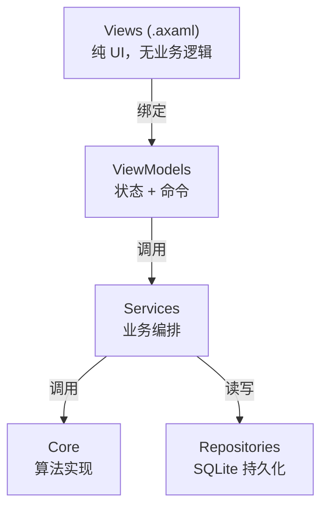

# 使用说明

本文档面向最终用户和开发者，介绍 **Find My Favourite Music（音乐品味预测系统）** 的环境要求、构建运行、功能使用、配置说明与扩展方法。

---

## 1. 项目简介

**一句话定位**：基于 .NET 10 + Avalonia 12 的跨平台桌面应用，通过分析音频特征预测你对歌曲的喜好程度。

**核心能力**：

| 能力 | 说明 |
|------|------|
| 音乐库管理 | 扫描本地目录，自动提取音频特征并存入 SQLite |
| 声学特征提取 | MFCC + 频谱质心 + 色度，共 52 维 |
| 深度特征提取（可选） | 基于 VGGish ONNX 模型，128 维 |
| 用户画像构建 | 从"喜欢"歌曲聚合均值向量，支持 Welford 增量更新 |
| 喜好预测 | 余弦相似度 + 加权评分，输出 0–100 匹配度 |
| 跨平台 UI | Avalonia MVVM，支持 Windows / macOS / Linux |

---

## 2. 环境要求

### 2.1 必需

- **.NET 10 SDK**（项目 `TargetFramework` 为 `net10.0`，`LangVersion` 为 `preview`）
- 操作系统：Windows 10+ / macOS / Linux（桌面环境）

### 2.2 平台差异

| 功能 | Windows | macOS | Linux |
|------|---------|-------|-------|
| WAV 解码 | ✅ | ✅ | ✅ |
| MP3 解码 | ✅ | ✅ | ✅ |
| FLAC 解码 | ✅ | ❌ | ❌ |
| M4A 解码 | ✅ | ❌ | ❌ |

> FLAC/M4A 依赖 Windows Media Foundation 系统解码器，非 Windows 平台无法解码这两类格式（详见 FAQ）。

### 2.3 可选

- **VGGish ONNX 模型文件**：用于启用深度特征提取，提升预测精度。无此文件时系统以"仅声学"模式运行。

---

## 3. 获取与构建

### 3.1 克隆仓库

```bash
git clone <repository-url>
cd find-my-favourite-music
```

### 3.2 还原与构建

项目使用 [Central Package Management](https://learn.microsoft.com/dotnet/core/tools/dependencies#central-package-management)，所有 NuGet 版本集中在 `src/Directory.Packages.props`，无需手动指定版本。

```bash
cd src
dotnet build
```

构建配置要求 **0 错误、0 警告**（`TreatWarningsAsErrors` 已开启）。

### 3.3 构建产物

- 各项目默认输出到 `src/{Project}/bin/Debug/net10.0/`
- GUI 项目输出类型为 `WinExe`，产物为 `FindMyFavouriteMusic.GUI.dll`（Windows 下为 `.exe`）
- `appsettings.json` 会被自动复制到输出目录

---

## 4. 运行应用

### 4.1 命令行启动

```bash
dotnet run --project src/FindMyFavouriteMusic.GUI
```

或先 `cd` 到 GUI 目录：

```bash
cd src/FindMyFavouriteMusic.GUI
dotnet run
```

### 4.2 首次运行行为

- 应用启动时由 `DatabaseInitializer`（`IHostedService`）自动创建 SQLite 数据库文件 `findmyfavouritemusic.db`，位于 GUI 输出目录。
- 建表 SQL 使用 `CREATE TABLE IF NOT EXISTS`，重复启动不会破坏已有数据。
- 若 `appsettings.json` 中 `OnnxModel.EnableDeepFeatures` 为 `true` 且指定了模型路径，会尝试自动加载 VGGish 模型；加载失败仅记录警告，不影响应用启动。

### 4.3 全局异常处理

`Program.cs` 注册了 `AppDomain.UnhandledException` 和 `TaskScheduler.UnobservedTaskException` 两个全局异常处理器，避免未处理异常导致应用静默崩溃。

---

## 5. 功能使用指南

应用主窗口左侧为导航栏，包含三个功能页：**音乐库 / 预测 / 设置**。

### 5.1 音乐库管理

**入口**：左侧导航 → "音乐库"

**扫描目录**：

1. 点击"扫描目录"按钮
2. 在弹出的文件夹选择对话框中选中音乐文件夹
3. 系统递归扫描所有支持的音频文件（默认 `.mp3 / .wav / .flac / .m4a`）
4. 每个文件依次执行：解码 → 提取声学特征 →（可选）提取深度特征 → 存入数据库
5. 进度条实时显示扫描进度，扫描完成后列表展示所有歌曲

> **并发控制**：默认最多 2 个文件并行处理（`ScanOptions.MaxConcurrentProcessing`），通过 `SemaphoreSlim` 限流，避免 CPU 过载。

**标记喜欢**：

- 每首歌曲右侧显示爱心图标：`♡`（未喜欢）/ `♥`（已喜欢）
- 点击图标切换喜欢状态
- **标记喜欢**：触发画像增量更新（Welford 算法）
- **取消喜欢**：触发画像全量重建

**加载已有歌曲**：若数据库中已有歌曲记录，可点击"加载"按钮直接展示，无需重新扫描。

### 5.2 喜好预测

**入口**：左侧导航 → "预测"

**前置条件**：必须先在音乐库中标记至少一首喜欢的歌曲，以构建用户画像。否则预测按钮会提示"请先在音乐库中标记喜欢的歌曲以构建画像"。

**预测步骤**：

1. **选择音乐文件**：支持两种方式
   - 点击"选择文件"按钮，在文件对话框中挑选（筛选 `*.mp3 / *.wav / *.flac / *.m4a / *.ogg / *.wma`）
   - 直接将文件**拖拽**到放置区（拖入时边框高亮，松开后自动填充路径）
2. 点击"开始预测"按钮
3. 系统执行：解码 → 提取特征 → 与用户画像计算余弦相似度 → 加权映射为 0–100 分
4. 结果区域显示：
   - **总分**（0–100）：加权后的匹配度
   - **声学得分**：仅声学特征的相似度
   - **深度得分**：仅深度特征的相似度（若启用）
   - **当前模式**：`声学模式` 或 `深度增强模式`

**分数颜色编码**（由 `ScoreToColorConverter` 实现）：

| 分数区间 | 颜色 | 含义 |
|----------|------|------|
| ≥ 70 | 绿色 `#10b981` | 高度匹配 |
| 30–70 | 黄色 `#f59e0b` | 中等匹配 |
| < 30 | 红色 `#ef4444` | 低匹配 |

### 5.3 设置

**入口**：左侧导航 → "设置"

**可配置项**：

| 配置 | 操作 | 持久化位置 |
|------|------|-----------|
| 声学特征权重 | 调整数值 → 点击"保存权重" | `usersettings.json` |
| 深度特征权重 | 调整数值 → 点击"保存权重" | `usersettings.json` |
| ONNX 模型路径 | 填写路径 → 点击"保存 ONNX 配置" | `usersettings.json` |
| 启用深度特征 | 勾选开关 → 点击"保存 ONNX 配置" | `usersettings.json` |
| 加载模型 | 点击"加载模型"（立即生效，运行时加载到推理引擎） | 内存 |
| 重建画像 | 点击"重建画像"（基于所有已喜欢歌曲全量重算） | `UserProfile` 表 |

> **权重建议**：声学权重 + 深度权重之和应为 1.0。默认 0.4 + 0.6 = 1.0。
>
> **保存 vs 加载**：保存写入配置文件，下次启动生效；加载是即时把模型载入内存。启用深度特征需先保存配置 → 重启应用，或在设置页点击"加载模型"立即生效。

---

## 6. 配置说明

配置文件位于 `src/FindMyFavouriteMusic.GUI/appsettings.json`，运行时会被复制到输出目录。用户运行时修改的设置写入同目录的 `usersettings.json`。

### 6.1 完整配置示例

```json
{
  "FeatureExtraction": {
    "MfccCoefficientCount": 13,
    "MelFilterBankSize": 26,
    "FrameDurationSeconds": 0.025,
    "HopDurationSeconds": 0.010,
    "TargetSampleRate": 16000,
    "EnableNormalization": false
  },
  "Prediction": {
    "AcousticWeight": 0.4,
    "DeepWeight": 0.6,
    "AcousticOnlyWeight": 1.0
  },
  "OnnxModel": {
    "VggishModelPath": null,
    "EnableDeepFeatures": false
  },
  "Database": {
    "ConnectionString": "Data Source=findmyfavouritemusic.db"
  },
  "Scan": {
    "SupportedExtensions": [ ".mp3", ".wav", ".flac", ".m4a" ],
    "MaxConcurrentProcessing": 2
  }
}
```

### 6.2 FeatureExtraction（特征提取）

| 字段 | 类型 | 默认值 | 说明 |
|------|------|--------|------|
| `MfccCoefficientCount` | int | 13 | MFCC 系数数量，典型值 13~20 |
| `MelFilterBankSize` | int | 26 | 梅尔滤波器组数量，通常为 MFCC 系数数的 2 倍 |
| `FrameDurationSeconds` | double | 0.025 | 帧长（秒），25ms 对应语音短时平稳假设 |
| `HopDurationSeconds` | double | 0.010 | 帧移（秒），10ms 对应 60% 重叠 |
| `TargetSampleRate` | int | 16000 | 目标采样率（Hz），VGGish 与多数声学模型使用 16kHz |
| `EnableNormalization` | bool | false | 是否对最终聚合向量做 Z-Score 归一化（详见算法说明 §8） |

> 修改此节后需重新扫描音乐库并重建画像，旧特征向量维度/尺度可能不兼容。

### 6.3 Prediction（预测权重）

| 字段 | 类型 | 默认值 | 说明 |
|------|------|--------|------|
| `AcousticWeight` | double | 0.4 | 声学+深度模式下的声学权重 |
| `DeepWeight` | double | 0.6 | 声学+深度模式下的深度权重 |
| `AcousticOnlyWeight` | double | 1.0 | 仅声学模式下的声学权重 |

> 通过设置页 UI 调整后会写入 `usersettings.json`，应用通过 `reloadOnChange: true` 监听变更。

### 6.4 OnnxModel（ONNX 模型）

| 字段 | 类型 | 默认值 | 说明 |
|------|------|--------|------|
| `VggishModelPath` | string? | null | VGGish ONNX 模型文件绝对路径 |
| `EnableDeepFeatures` | bool | false | 是否启用深度特征提取 |

### 6.5 Database（数据库）

| 字段 | 类型 | 默认值 | 说明 |
|------|------|--------|------|
| `ConnectionString` | string | `Data Source=findmyfavouritemusic.db` | SQLite 连接字符串 |

如需指定数据库文件位置，可改为绝对路径，例如：`Data Source=D:/Data/fmm.db`。

### 6.6 Scan（扫描）

| 字段 | 类型 | 默认值 | 说明 |
|------|------|--------|------|
| `SupportedExtensions` | string[] | `[".mp3", ".wav", ".flac", ".m4a"]` | 扫描时识别的音频扩展名 |
| `MaxConcurrentProcessing` | int | 2 | 最大并发解码+特征提取数 |

### 6.7 配置优先级

应用启动时按以下顺序加载配置源（**后者覆盖前者同名键**）：

1. `appsettings.json`（基础默认值，随构建产物分发）
2. `usersettings.json`（用户运行时设置，UI 修改写于此）
3. 环境变量（前缀 `FINDMYFAVOURITEMUSIC_`，用于敏感配置覆盖）

例如，通过环境变量覆盖数据库连接字符串：

```bash
# Windows PowerShell
$env:FINDMYFAVOURITEMUSIC_Database__ConnectionString = "Data Source=D:/Data/fmm.db"

# Linux/macOS
export FINDMYFAVOURITEMUSIC_Database__ConnectionString="Data Source=/var/data/fmm.db"
```

> 环境变量层级用双下划线 `__` 分隔，对应 JSON 的层级。

---

## 7. ONNX 模型集成

### 7.1 什么是 VGGish

VGGish 是 Google 在 AudioSet（200 万视频、5800 类音频事件）上预训练的卷积神经网络，输入为 log-mel 频谱图，输出 128 维嵌入向量。它能捕获 MFCC 等手工特征难以表达的高层语义（乐器、人声、环境音等），用于增强音乐相似度判断。

### 7.2 获取 VGGish ONNX 模型

1. 从 [ONNX Model Zoo](https://github.com/onnx/models) 或 TensorFlow 官方 [VGGish 仓库](https://github.com/tensorflow/models/tree/master/research/audioset/vggish) 获取预训练模型
2. 若取得的是 TensorFlow checkpoint，需用 [tf2onnx](https://github.com/onnx/tensorflow-onnx) 转换为 ONNX 格式：
   ```bash
   python -m tf2onnx.convert --saved-model vggish_saved_model --output vggish.onnx
   ```
3. 将 `vggish.onnx` 放置到任意可读路径，例如 `D:/Models/vggish.onnx`

> 模型输入应为形状 `[batch, 1, 96, 64]` 的 `float32` 张量，输出为 `[batch, 128]`。本项目代码假设此格式。

### 7.3 配置模型路径

**方式 A：编辑配置文件**

修改 `appsettings.json`（或 `usersettings.json`）：

```json
{
  "OnnxModel": {
    "VggishModelPath": "D:/Models/vggish.onnx",
    "EnableDeepFeatures": true
  }
}
```

重启应用，`DeepFeatureExtractor` 构造函数会自动加载模型。

**方式 B：通过 UI 配置（推荐）**

1. 打开"设置"页
2. 在"ONNX 模型路径"输入框填入模型绝对路径
3. 勾选"启用深度特征"
4. 点击"保存 ONNX 配置"（写入 `usersettings.json`）
5. 点击"加载模型"（立即加载到内存，无需重启）
6. 模型加载成功后，"当前模型已加载"指示灯亮起

### 7.4 验证深度特征已启用

进入"预测"页，对一首歌曲进行预测：

- **状态**显示"深度增强模式" → 深度特征已生效
- **状态**显示"声学模式" → 模型未加载或待预测歌曲/画像缺少深度向量

> 启用深度特征后，**已扫描的歌曲不会自动补提深度向量**。如需为历史歌曲补提，需删除数据库中的 Songs 记录后重新扫描，或手动调用 `ProcessSongAsync`。

---

## 8. 项目结构说明

### 8.1 解决方案布局

```
src/
├── FindMyFavouriteMusic.Core/       # 核心层：音频解码、特征提取、相似度计算
│   ├── Audio/                       # 解码与预处理
│   ├── Configuration/               # IOptions 配置类
│   ├── Features/                    # 声学/深度特征提取
│   ├── Interfaces/                  # 核心接口
│   └── Prediction/                  # 相似度、预测引擎、向量序列化
├── FindMyFavouriteMusic.Models/     # 模型层：实体、DTO、枚举、Result
│   ├── Dtos/                        # 数据传输对象
│   ├── Entities/                    # 数据库实体
│   ├── Enums/                       # 枚举
│   └── Results/                     # Result / Result<T>
├── FindMyFavouriteMusic.Services/   # 服务层：业务编排、SQLite 仓储
│   ├── Database/                    # 仓储实现、配置、初始化
│   └── Interfaces/                  # 服务接口
├── FindMyFavouriteMusic.GUI/        # UI 层：Avalonia MVVM
│   ├── Converters/                  # 值转换器
│   ├── Styles/                      # 全局样式
│   ├── ViewModels/                  # 视图模型
│   └── Views/                       # 视图
├── FindMyFavouriteMusic.Tests/      # xUnit 单元测试
├── Directory.Build.props            # 统一 TargetFramework、命名空间、警告设置
└── Directory.Packages.props         # 集中 NuGet 版本管理
```

### 8.2 各项目职责

| 项目 | 职责 | 依赖 |
|------|------|------|
| `Core` | 音频解码、特征提取、相似度计算、向量序列化 | `Models`、NAudio、NWaves、OnnxRuntime |
| `Models` | 实体、DTO、枚举、Result 模式 | 无（最底层） |
| `Services` | 业务编排、SQLite 仓储、用户设置 | `Core`、`Models`、Dapper、Microsoft.Data.Sqlite |
| `GUI` | Avalonia UI、MVVM、依赖注入组装 | `Core`、`Models`、`Services`、CommunityToolkit.Mvvm |
| `Tests` | 核心算法单元测试 | `Core`、xUnit、FluentAssertions、Moq |

### 8.3 命名空间约定

所有项目代码命名空间统一为 `Larpx.PersonalTools.FindMyFavouriteMusic.{Layer}`，由 `src/Directory.Build.props` 中的 `RootNamespace` 自动拼接：

```xml
<RootNamespace>Larpx.PersonalTools.$(MSBuildProjectName)</RootNamespace>
```

例如：
- `FindMyFavouriteMusic.Core` → `Larpx.PersonalTools.FindMyFavouriteMusic.Core`
- `FindMyFavouriteMusic.GUI` → `Larpx.PersonalTools.FindMyFavouriteMusic.GUI`

### 8.4 关键 NuGet 依赖

| 包 | 版本 | 用途 |
|----|------|------|
| Avalonia | 12.0.5 | 跨平台 UI 框架 |
| CommunityToolkit.Mvvm | 8.4.1 | MVVM 源生成器（ObservableProperty / RelayCommand） |
| NAudio | 2.3.0 | 音频解码（WAV/MP3/FLAC/M4A） |
| NWaves | 0.9.6 | 信号处理（MFCC、频谱、色度） |
| Microsoft.ML.OnnxRuntime | 1.22.0 | ONNX 模型推理 |
| Microsoft.Data.Sqlite | 9.0.5 | SQLite ADO.NET 提供程序 |
| Dapper | 2.1.66 | 轻量级 ORM |
| Microsoft.Extensions.Hosting | 9.0.5 | 依赖注入与配置 |

---

## 9. 架构与扩展

### 9.1 MVVM 分层



- **View**：`*.axaml` 文件，仅声明 UI 结构与数据绑定。Code-behind（`*.axaml.cs`）只处理纯 UI 交互（如文件对话框、拖拽事件），不直接调用服务。
- **ViewModel**：继承 `ViewModelBase`，使用 `[ObservableProperty]` 和 `[RelayCommand]` 源生成器声明属性与命令。通过构造函数注入服务接口。
- **Service**：实现 `I*Service` 接口，封装跨层编排逻辑，返回 `Result` / `Result<T>` 表达成功/失败。

### 9.2 依赖注入

应用入口 `App.axaml.cs` 使用 `Microsoft.Extensions.Hosting` 构建 DI 容器：

```csharp
// src/FindMyFavouriteMusic.GUI/App.axaml.cs
return Host.CreateDefaultBuilder()
    .ConfigureAppConfiguration((context, config) =>
    {
        config.AddJsonFile("appsettings.json", optional: true, reloadOnChange: true);
        config.AddJsonFile("usersettings.json", optional: true, reloadOnChange: true);
        config.AddEnvironmentVariables("FINDMYFAVOURITEMUSIC_");
    })
    .ConfigureServices((context, services) =>
    {
        // 配置项绑定
        services.Configure<FeatureExtractionOptions>(
            context.Configuration.GetSection(FeatureExtractionOptions.SectionName));
        // ... 其他 Options 绑定

        // Core 层服务（单例）
        services.AddSingleton<IAudioDecoder, AudioDecoder>();
        services.AddSingleton<IAcousticFeatureExtractor, AcousticFeatureExtractor>();
        services.AddSingleton<IDeepFeatureExtractor, DeepFeatureExtractor>();
        // ...

        // Hosted Service：数据库初始化
        services.AddHostedService(sp => sp.GetRequiredService<DatabaseInitializer>());

        // ViewModels（瞬态）
        services.AddTransient<MainWindowViewModel>();
        // ...
    })
    .Build();
```

**生命周期策略**：
- **Singleton**：Core 算法组件、Repositories、Services（无状态或线程安全）
- **Transient**：ViewModels（每次导航创建新实例）
- **HostedService**：`DatabaseInitializer` 在应用启动时执行一次建表

### 9.3 扩展：添加新的声学特征提取器

实现 `IAcousticFeatureExtractor` 接口并注册到 DI 容器即可替换或新增声学特征提取逻辑。

**步骤**：

1. **实现接口**：

   ```csharp
   // src/FindMyFavouriteMusic.Core/Features/MyFeatureExtractor.cs
   using Larpx.PersonalTools.FindMyFavouriteMusic.Core.Interfaces;
   using Larpx.PersonalTools.FindMyFavouriteMusic.Models.Results;

   namespace Larpx.PersonalTools.FindMyFavouriteMusic.Core.Features;

   /// <summary>
   /// 自定义声学特征提取器
   /// </summary>
   public class MyFeatureExtractor : IAcousticFeatureExtractor
   {
       public int FeatureDimension => 64; // 自定义维度

       public Result<float[]> Extract(float[] samples, int sampleRate)
       {
           // 实现特征提取逻辑
           var features = new float[FeatureDimension];
           // ...
           return Result<float[]>.Success(features);
       }
   }
   ```

2. **注册到 DI**（替换默认实现）：

   ```csharp
   // src/FindMyFavouriteMusic.GUI/App.axaml.cs
   services.AddSingleton<IAcousticFeatureExtractor, MyFeatureExtractor>();
   ```

3. **注意维度一致性**：若改变了特征维度，需同步更新 `PredictionEngine` 的兼容性检查，并重建所有歌曲特征与画像（旧 BLOB 维度不兼容）。

### 9.4 扩展：添加新的音频格式支持

`AudioDecoder` 通过 `AudioFormat` 枚举与 `CreateReader` switch 表达式分发。添加新格式步骤：

1. **在 `AudioFormat` 枚举中新增成员**：

   ```csharp
   // src/FindMyFavouriteMusic.Models/Enums/AudioFormat.cs
   public enum AudioFormat
   {
       Unknown,
       Wav,
       Mp3,
       Flac,
       M4a,
       Ogg  // 新增
   }
   ```

2. **在 `AudioFormatDetector.ExtensionMap` 中注册扩展名**：

   ```csharp
   // src/FindMyFavouriteMusic.Core/Audio/AudioFormatDetector.cs
   [".ogg"] = AudioFormat.Ogg,
   ```

3. **在 `AudioDecoder.SupportsFormat` 与 `CreateReader` 中实现**：

   ```csharp
   // src/FindMyFavouriteMusic.Core/Audio/AudioDecoder.cs
   public bool SupportsFormat(AudioFormat format) => format switch
   {
       // ...
       AudioFormat.Ogg => OperatingSystem.IsWindows(), // 视解码器支持而定
       _ => false
   };

   private static WaveStream CreateReader(string filePath, AudioFormat format) => format switch
   {
       // ...
       AudioFormat.Ogg when OperatingSystem.IsWindows() => new MediaFoundationReader(filePath),
       _ => throw new NotSupportedException($"不支持的格式: {format}")
   };
   ```

4. **更新 `ScanOptions.SupportedExtensions`**：

   ```json
   "Scan": {
     "SupportedExtensions": [".mp3", ".wav", ".flac", ".m4a", ".ogg"]
   }
   ```

5. **更新文件选择对话框的扩展名筛选**（`PredictionView.axaml.cs` 中的 `FileTypeFilter`）。

### 9.5 扩展：替换相似度算法

实现 `ISimilarityCalculator` 接口（如欧氏距离、马氏距离）：

```csharp
services.AddSingleton<ISimilarityCalculator, EuclideanSimilarityCalculator>();
```

注意：相似度取值范围若非 `[-1, 1]`，需同步修改 `PredictionEngine.MapToScore` 的映射公式。

---

## 10. 常见问题（FAQ）

### Q1：为什么 FLAC/M4A 在 Linux/macOS 上无法解码？

**A**：项目使用 NAudio 的 `MediaFoundationReader` 解码 FLAC/M4A，该 Reader 依赖 Windows Media Foundation 系统解码器，仅 Windows 平台可用。`AudioDecoder.SupportsFormat` 中通过 `OperatingSystem.IsWindows()` 显式判断，非 Windows 平台会返回 `false`，解码时直接返回失败结果。

**解决方案**：
- 在 Linux/macOS 上仅使用 WAV / MP3 格式
- 或自行扩展 `AudioDecoder`，集成跨平台的 [FFmpegAutoGen](https://github.com/Ruslan-B/FFmpeg.AutoGen) 或 [Vorbis](https://github.com/atenfek/OggVorbisEncoder) 解码器

### Q2：为什么预测分数偏低？

**A**：可能原因：

1. **画像歌曲太少**：仅 1–2 首歌时画像均值缺乏代表性，建议至少标记 10+ 首
2. **歌曲风格差异大**：若喜欢的歌曲风格跨度过大，均值向量会落在"中间地带"，与任何单曲都不够相似
3. **仅声学模式**：未启用深度特征时，仅靠 52 维声学特征可能区分力不足，建议启用 VGGish
4. **特征维度不匹配**：若修改过 `MfccCoefficientCount` 等参数但未重建画像，会导致维度不一致

### Q3：如何重置用户画像？

**A**：三种方式：

1. **UI 方式（推荐）**：进入"设置"页 → 点击"重建画像"按钮
2. **取消所有喜欢**：在音乐库中取消每首歌曲的喜欢标记，画像会自动重建（无喜欢歌曲时画像为空）
3. **直接清空数据库**：删除 `UserProfile` 表中 `Id = 1` 的记录，或删除整个 `findmyfavouritemusic.db` 文件后重启应用

### Q4：数据库文件在哪里？

**A**：默认位于 GUI 项目的输出目录，即 `src/FindMyFavouriteMusic.GUI/bin/Debug/net10.0/findmyfavouritemusic.db`（Debug 构建）。可通过 `Database.ConnectionString` 配置项指定绝对路径。

### Q5：扫描大量文件时很慢，如何加速？

**A**：
- 增大 `Scan.MaxConcurrentProcessing`（默认 2），但注意 CPU 核心数与内存限制
- 启用深度特征会显著增加单文件耗时（VGGish 推理为 CPU 密集型），初次扫描可先关闭，扫描完成后再补提
- 已扫描过的文件不会重复处理（`MusicLibraryService.ProcessSongAsync` 会先按 `FilePath` 查询）

### Q6：修改了配置不生效？

**A**：检查清单：
1. 是否修改的是输出目录下的 `appsettings.json` / `usersettings.json`，而非源码目录中的？运行时读取的是输出目录文件
2. `reloadOnChange: true` 已开启，但部分配置（如 `FeatureExtraction`）只在服务构造时读取一次，需重启应用
3. 环境变量优先级最高，确认未误设 `FINDMYFAVOURITEMUSIC_*` 变量覆盖配置

### Q7：启用 ONNX 后预测变慢？

**A**：VGGish 推理是 CPU 密集型操作，单首歌曲需对多个 0.96s 帧分别做前向推理。优化方向：
- 缩短音频时长（截取前 30s）
- 使用量化版 ONNX 模型（INT8 量化）
- 在支持 AVX2/AVX-512 的 CPU 上运行，OnnxRuntime 会自动利用

### Q8：日志在哪里查看？

**A**：应用配置了 `Microsoft.Extensions.Logging.Console`，日志输出到 stdout（控制台）。从命令行启动应用（`dotnet run`）即可看到结构化日志，包括扫描进度、解码失败、模型加载状态等。

---

## 11. 测试

### 11.1 运行单元测试

```bash
cd src
dotnet test
```

测试项目位于 `src/FindMyFavouriteMusic.Tests/`，使用 xUnit + FluentAssertions + Moq。

### 11.2 测试覆盖范围

| 测试类 | 测试内容 |
|--------|----------|
| `CosineSimilarityCalculatorTests` | 余弦相似度：相同/正交/相反/零向量/维度不匹配/空向量 |
| `VectorSerializerTests` | 序列化往返、空数组、null 参数 |
| `FeatureAggregatorTests` | 单帧/多帧聚合、空帧异常 |

测试命名遵循 `Method_Scenario_ExpectedResult` 约定，模式为 AAA（Arrange-Act-Assert）。

### 11.3 测试示例

```csharp
// src/FindMyFavouriteMusic.Tests/Core/CosineSimilarityCalculatorTests.cs
[Fact]
public void Calculate_SameVector_ReturnsOne()
{
    var vector = new float[] { 1, 0, 0 };
    var result = _calculator.Calculate(vector, vector);

    Assert.True(result.IsSuccess);
    Assert.Equal(1.0, result.Value, 5);
}
```

---

**文档版本**：基于项目源码撰写，最后核对日期 2026-06-30。
