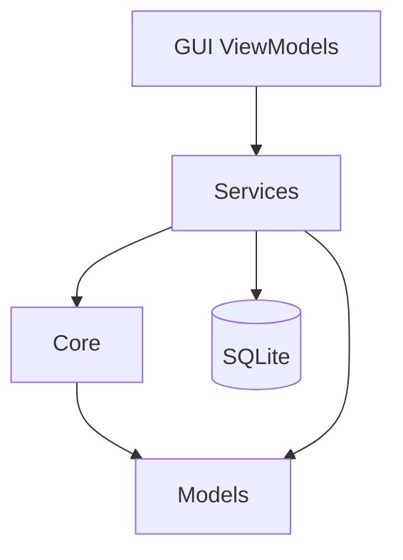

# 开发说明

本文面向**二次开发与维护者**，汇总环境构建、架构、功能边界、配置扩展、测试约定，以及已完成的整改脉络。  
一般用户请看 [用户使用说明](用户使用说明.md)；算法与端到端数据处理细节见 [算法说明](算法说明.md)。

---

## 1. 项目目标与范围

### 1.1 目标

基于 **.NET 10 + Avalonia** 的桌面应用，能够：

- 扫描本地音乐库并提取声学 /（可选）深度特征
- 根据「喜欢」构建品味画像
- 对新歌输出 0–100 匹配分数
- 在音乐库中编辑标签与封面并写回原文件

### 1.2 当前能力（产品视角）

| 模块 | 说明 |
|------|------|
| 音乐库 | 目录扫描、MD5 特征缓存、喜欢标记、右侧详情与标签/封面写回 |
| 声学特征 | NWaves：MFCC + 频谱质心 + 色度 → 52 维 |
| 深度特征 | ONNX：VGGish（128）或 MERT（768）；未加载则降级仅声学 |
| 画像 | 全量重建 + Welford 增量；空喜欢清空；声学/深度样本数分别持久化 |
| 预测 | 余弦相似度 + 加权评分；支持按文件 / 按曲库 Id |
| 设置 | AppData `usersettings.json` 原子写入；权重 / ONNX / 扫描并发等 |

### 1.3 本仓库明确不做（历史需求中的进阶项）

- 分类模型训练（逻辑回归 / LightGBM 等）
- 在线抓取歌词 / 封面
- 内置播放器与播放队列

---

## 2. 解决方案结构

```
src/
├── Directory.Packages.props          # Central Package Management（版本只改这里）
├── Directory.Build.props / .targets  # 公共属性、OpenVINO native 复制
├── FindMyFavouriteMusic.Models/      # 实体、DTO、Result、枚举
├── FindMyFavouriteMusic.Core/        # 解码、特征、相似度、硬件 EP
├── FindMyFavouriteMusic.Services/    # 业务编排、仓储、设置、标签
├── FindMyFavouriteMusic.GUI/         # Avalonia Views / ViewModels
└── FindMyFavouriteMusic.Tests/       # 单元与集成测试（含 Hardware 可选）
```

命名空间统一为 `Larpx.PersonalTools.FindMyFavouriteMusic.{Layer}`（由 `RootNamespace` 拼接）。

分层关系概要：



端到端数据流与数学细节见 [算法说明 §1](算法说明.md)。

---

## 3. 环境、构建与运行

### 3.1 环境

- .NET 10 SDK
- Windows 推荐（FLAC/M4A 依赖 Media Foundation）；WAV/MP3 跨平台更完整
- 包源：仓库根目录 `nuget.config`（nuget.org）
- 可选：VGGish / MERT ONNX 模型文件

### 3.2 构建与运行

```bash
cd src
dotnet build
dotnet run --project FindMyFavouriteMusic.GUI
```

要求 **0 错误、0 警告**（`TreatWarningsAsErrors`）。

NuGet：各 csproj 只写 `PackageReference` 的 `Include`，版本集中在 `Directory.Packages.props`，并启用传递依赖钉死。

### 3.3 首次运行

- `DatabaseInitializer` 创建/迁移 SQLite（`PRAGMA user_version`）
- 库文件默认：`findmyfavouritemusic.db`（GUI 输出目录，可用配置覆盖）
- 用户设置：`%AppData%/FindMyFavouriteMusic/usersettings.json`（可从应用目录旧文件迁移）

---

## 4. 配置要点

默认：`FindMyFavouriteMusic.GUI/appsettings.json`（复制到输出目录）。  
用户运行时：AppData `usersettings.json`（写锁 + 临时文件原子替换）。

优先级（后者覆盖前者）：`appsettings` → 应用目录旧 `usersettings` → AppData `usersettings` → 环境变量（前缀 `FINDMYFAVOURITEMUSIC_`）。

关键节：`FeatureExtraction`、`Prediction`、`OnnxModel`、`Database`、`Scan`。字段含义与推荐值见 [算法说明 §9](算法说明.md)。

护栏与契约摘要：

- 单文件硬限 **200MB**（解码 / 扫描统一）
- 文件内容 **MD5**：未变且深度契约匹配 → 跳过重算；元数据写回更新 MD5、默认保留向量
- 模型热切换：成功后再 Dispose 旧 Session；加载与扫描/预测互斥（`IModelOperationLock`）

---

## 5. UI 与扩展入口

### 5.1 MVVM

- View：`*.axaml`；Code-behind 仅对话框 / 拖拽等 UI 交互
- ViewModel：CommunityToolkit.Mvvm（`ObservableProperty` / `RelayCommand`）
- 服务通过构造函数注入，返回 `Result` / `Result<T>`

### 5.2 常见扩展方向

| 目标 | 切入点 |
|------|--------|
| 新声学特征 | 实现 `IAcousticFeatureExtractor` 并替换 DI 注册 |
| 新音频格式 | `AudioFormatDetector` + `AudioDecoder` Reader 选择 |
| 新相似度 | 实现 `ISimilarityCalculator`，在 `PredictionEngine` 侧替换 |
| 新深度模型 | 仿照 VGGish/MERT 提取器，经 `DeepFeatureExtractorFactory` 路由 |

ONNX EP（OpenVINO / CPU）性能对比与选型见 [算法说明 §10](算法说明.md)。

---

## 6. 测试与覆盖

### 6.1 命令

```bash
cd src
# 日常（不含本机 Hardware/ONNX 集成）
dotnet test FindMyFavouriteMusic.Tests --filter "FullyQualifiedName!~Hardware"

# 本机有模型与 OpenVINO 时
dotnet test FindMyFavouriteMusic.Tests --filter "FullyQualifiedName~Hardware"

# 覆盖率
dotnet test FindMyFavouriteMusic.Tests --filter "FullyQualifiedName!~Hardware" \
  --collect:"XPlat Code Coverage" --results-directory ../TestResults
```

### 6.2 约定

| 范围 | 策略 |
|------|------|
| Models / Services 业务路径 / Core 工具类 | 单元 + 内存 SQLite，目标高覆盖 |
| TagLib 标签读写 | 临时音频文件往返 |
| ONNX / Hardware / Avalonia View·VM | 不强制日常全覆盖门槛 |
| GUI 交互 | 手工验收 + 服务层契约测试 |

建议门槛（日常 CI）：Models ≥ 90% line；Services ≥ 80% line；Core 非 ONNX 公共 API 有用例。

---

## 7. 整改脉络（已合入主线）

下列阶段已在代码中落地，便于新成员理解「为什么现在是这样」：

| 阶段 | 内容 | 状态 |
|------|------|------|
| A | 模型 Dispose、加载互斥、200MB、Predict(id) BLOB、画像空喜欢清空 / Like no-op | 完成 |
| B | `user_version` 迁移、Songs/Profile 扩展列、MD5 缓存、深度契约、样本数列、指纹更新 | 完成 |
| C | AppData 设置、原子写、AcousticOnlyWeight / CacheDir / 并发等持久化 | 完成 |
| D | 左右分栏详情、TagLib 读写原文件、封面不入库 | 完成 |
| E–F | 健壮性与体验项 | 部分后续可选 |

封面：文件内嵌 picture，详情实时读取；标签写回后更新 MD5 并保留向量。

---

## 8. 开发侧 FAQ

**FLAC/M4A 在非 Windows 失败？**  
依赖系统 Media Foundation，属平台限制。

**改配置不生效？**  
区分输出目录 `appsettings` 与 AppData `usersettings`；部分选项仅构造时读取需重启；注意环境变量覆盖。

**如何重置画像？**  
设置页「重建画像」、取消全部喜欢，或删除库中 `UserProfile` / 整个 db 后重启。

**日志？**  
控制台 stdout（`dotnet run` 可见）。

---

## 9. 文档索引

| 文档 | 内容 |
|------|------|
| [用户使用说明](用户使用说明.md) | 安装与操作（非技术） |
| [算法说明](算法说明.md) | 解码、特征、画像、相似度、EP 基准 |
| [README](../README.md) / [README.en.md](../README.en.md) | 仓库入口 |
| `LICENSE` | MIT |
