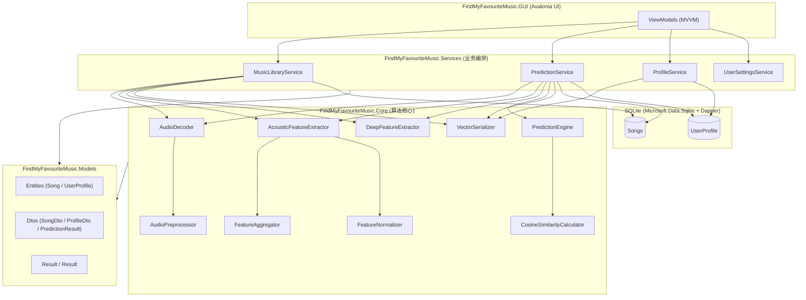

# 算法说明

本文档详细说明 **Find My Favourite Music（音乐品味预测系统）** 中所有核心算法的工作原理，方便学习者理解从音频文件到匹配度分数的完整链路。所有内容均基于 `src/` 目录下的实际源码撰写。

> 命名空间约定：所有项目统一使用 `Larpx.PersonalTools.FindMyFavouriteMusic.{Layer}` 前缀，由 `src/Directory.Build.props` 中的 `RootNamespace` 自动拼接。

---

## 1. 系统总览

### 1.1 整体架构

系统采用分层架构，自下而上分为：模型层（Models）→ 核心层（Core）→ 服务层（Services）→ UI 层（GUI），各层通过接口与依赖注入解耦。



### 1.2 端到端数据流

```mermaid
flowchart LR
    A[音乐文件<br/>mp3/wav/flac/m4a] --> B[AudioDecoder<br/>NAudio 解码]
    B --> C[AudioPreprocessor<br/>多声道合并 + 重采样]
    C --> D[float[] 单声道采样<br/>16kHz]
    D --> E1[AcousticFeatureExtractor<br/>52 维声学向量]
    D --> E2[DeepFeatureExtractor<br/>128 维 VGGish 向量]
    E1 --> F[VectorSerializer<br/>float[] → byte[]]
    E2 --> F
    F --> G[(SQLite Songs 表)]

    G -->|标记喜欢| H[ProfileService<br/>构建用户画像]
    H --> I[(SQLite UserProfile 表)]

    G --> J[PredictionEngine<br/>余弦相似度 + 加权]
    I --> J
    J --> K[PredictionResult<br/>0-100 匹配度分数]
    K --> L[UI 展示]
```

**核心数据流（扫描→解码→特征提取→画像构建→预测）：**

1. **扫描**：`MusicLibraryService.ScanDirectoryAsync` 递归枚举目录，按 `ScanOptions.SupportedExtensions` 过滤音频文件。
2. **解码**：`AudioDecoder.DecodeAsync` 调用 NAudio Reader 读取 PCM 字节，按位深度转 `float[]`，再经 `AudioPreprocessor` 完成多声道合并与重采样。
3. **特征提取**：`AcousticFeatureExtractor` 输出 52 维声学向量；若 ONNX 模型已加载，`DeepFeatureExtractor` 额外输出 128 维深度向量。
4. **画像构建**：用户标记喜欢时，`ProfileService` 触发画像更新（增量或全量重建），将均值向量写入 `UserProfile` 表。
5. **预测**：`PredictionService.PredictAsync` 解码待预测文件 → 提取特征 → 与画像均值向量计算余弦相似度 → 加权映射为 0–100 分。

---

## 2. 音频解码与预处理算法

> 源码位置：
> - `src/FindMyFavouriteMusic.Core/Audio/AudioDecoder.cs`
> - `src/FindMyFavouriteMusic.Core/Audio/AudioPreprocessor.cs`
> - `src/FindMyFavouriteMusic.Core/Audio/AudioFormatDetector.cs`

### 2.1 格式识别与 Reader 选择

`AudioFormatDetector` 通过文件扩展名映射到 `AudioFormat` 枚举（`Wav / Mp3 / Flac / M4a / Unknown`）。`AudioDecoder.CreateReader` 根据格式选择 NAudio Reader：

| 格式 | Reader | 平台限制 |
|------|--------|----------|
| WAV  | `WaveFileReader` | 跨平台 |
| MP3  | `Mp3FileReader` | 跨平台 |
| FLAC | `MediaFoundationReader` | **仅 Windows** |
| M4A  | `MediaFoundationReader` | **仅 Windows** |

FLAC/M4A 依赖 Windows Media Foundation 系统解码器，因此非 Windows 平台 `SupportsFormat` 返回 `false`，解码时直接返回失败结果。

```csharp
// src/FindMyFavouriteMusic.Core/Audio/AudioDecoder.cs
private static WaveStream CreateReader(string filePath, AudioFormat format) => format switch
{
    AudioFormat.Wav => new WaveFileReader(filePath),
    AudioFormat.Mp3 => new Mp3FileReader(filePath),
    AudioFormat.Flac when OperatingSystem.IsWindows() => new MediaFoundationReader(filePath),
    AudioFormat.M4a when OperatingSystem.IsWindows() => new MediaFoundationReader(filePath),
    _ => throw new NotSupportedException($"不支持的格式: {format}")
};
```

### 2.2 PCM 字节转浮点采样（位深度处理）

NAudio 读取的 PCM 字节流需要按位深度归一化到 `[-1, 1]` 浮点区间。`ConvertToFloatSamples` 根据 `bitsPerSample` 分发到三个转换器：

**16 位 PCM**：每个采样 2 字节，有符号 `Int16`，除以 `32768`（即 2^15）。

```csharp
// src/FindMyFavouriteMusic.Core/Audio/AudioDecoder.cs
private static float[] Convert16BitToFloat(byte[] buffer, int bytesRead)
{
    var sampleCount = bytesRead / 2;
    var samples = new float[sampleCount];
    for (var i = 0; i < sampleCount; i++)
    {
        var sample = BitConverter.ToInt16(buffer, i * 2);
        samples[i] = sample / 32768f;
    }
    return samples;
}
```

**24 位 PCM**：每个采样 3 字节，手动拼接小端序 3 字节整数，**符号位扩展**后将 24 位无符号表示转回有符号整数，最后除以 `8388608`（即 2^23）。

```csharp
// src/FindMyFavouriteMusic.Core/Audio/AudioDecoder.cs
private static float[] Convert24BitToFloat(byte[] buffer, int bytesRead)
{
    var sampleCount = bytesRead / 3;
    var samples = new float[sampleCount];
    for (var i = 0; i < sampleCount; i++)
    {
        var byteIndex = i * 3;
        var sample = buffer[byteIndex] | (buffer[byteIndex + 1] << 8) | (buffer[byteIndex + 2] << 16);
        // 24 位有符号整数符号位扩展
        if ((sample & 0x800000) != 0) sample |= unchecked((int)0xFF000000);
        samples[i] = sample / 8388608f;
    }
    return samples;
}
```

**32 位 PCM**：每个采样 4 字节，`Int32`，除以 `2147483648`（即 2^31）。

### 2.3 多声道转单声道（取平均）

`AudioPreprocessor.ConvertToMono` 将多声道（立体声等）采样按帧取算术平均，得到单声道信号：

$$
\text{mono}[i] = \frac{1}{C} \sum_{ch=0}^{C-1} \text{samples}[i \times C + ch]
$$

其中 $C$ 为声道数，`frameCount = samples.Length / channels`。

```csharp
// src/FindMyFavouriteMusic.Core/Audio/AudioPreprocessor.cs
private static float[] ConvertToMono(float[] samples, int channels)
{
    var frameCount = samples.Length / channels;
    var mono = new float[frameCount];
    for (var i = 0; i < frameCount; i++)
    {
        var sum = 0f;
        for (var ch = 0; ch < channels; ch++)
        {
            sum += samples[i * channels + ch];
        }
        mono[i] = sum / channels;
    }
    return mono;
}
```

### 2.4 线性插值重采样

当源采样率与目标采样率（默认 16000 Hz）不一致时，`AudioPreprocessor.Resample` 使用**线性插值**进行采样率转换。这是计算量最小的重采样方法，适合对音质要求不极端的特征提取场景。

**算法原理**：

1. 计算采样率比值：`ratio = sourceRate / targetRate`
2. 输出长度：`outputLength = samples.Length / ratio`
3. 对每个输出采样点 $i$，定位源序列中的浮点索引 `sourceIndex = i × ratio`
4. 取相邻两点 `index1 = floor(sourceIndex)`、`index2 = index1 + 1`，按小数部分 `fraction` 做线性加权：

$$
\text{output}[i] = \text{samples}[\text{index1}] \times (1 - f) + \text{samples}[\text{index2}] \times f
$$

```csharp
// src/FindMyFavouriteMusic.Core/Audio/AudioPreprocessor.cs
private static float[] Resample(float[] samples, int sourceRate, int targetRate)
{
    var ratio = (double)sourceRate / targetRate;
    var outputLength = (int)(samples.Length / ratio);
    var output = new float[outputLength];

    for (var i = 0; i < outputLength; i++)
    {
        var sourceIndex = i * ratio;
        var index1 = (int)sourceIndex;
        var index2 = Math.Min(index1 + 1, samples.Length - 1);
        var fraction = sourceIndex - index1;
        output[i] = (float)(samples[index1] * (1 - fraction) + samples[index2] * fraction);
    }

    return output;
}
```

> **说明**：线性插值未做抗混叠滤波，对高频分量可能引入混叠失真。本项目的下游特征（MFCC、Mel 频谱）以 16 kHz 采样率为目标，对极高频不敏感，因此线性插值的精度足够。

### 2.5 预处理总入口

`AudioPreprocessor.Process` 串接"多声道合并 → 重采样"两步：

```csharp
// src/FindMyFavouriteMusic.Core/Audio/AudioPreprocessor.cs
public float[] Process(float[] samples)
{
    var mono = _channels > 1 ? ConvertToMono(samples, _channels) : samples;
    var resampled = _sourceSampleRate != _targetSampleRate
        ? Resample(mono, _sourceSampleRate, _targetSampleRate)
        : mono;
    return resampled;
}
```

解码流程属于 CPU 密集型操作，`AudioDecoder.DecodeAsync` 通过 `Task.Run` 切换到线程池执行，避免阻塞调用线程。

---

## 3. 声学特征提取算法

> 源码位置：
> - `src/FindMyFavouriteMusic.Core/Features/AcousticFeatureExtractor.cs`
> - `src/FindMyFavouriteMusic.Core/Features/FeatureAggregator.cs`
> - `src/FindMyFavouriteMusic.Core/Features/FeatureNormalizer.cs`

声学特征提取基于 [NWaves](https://github.com/ar1st0crat/NWaves) 信号处理库，最终输出 **52 维**向量。

### 3.1 整体流程

```mermaid
flowchart LR
    A[float[] 采样<br/>16kHz 单声道] --> B[分帧<br/>FFT=512]
    B --> C1[MfccExtractor<br/>13 维/帧]
    B --> C2[SpectralFeaturesExtractor<br/>1 维/帧]
    B --> C3[ChromaExtractor<br/>12 维/帧]
    C1 --> D1[FeatureAggregator<br/>26 维]
    C2 --> D2[FeatureAggregator<br/>2 维]
    C3 --> D3[FeatureAggregator<br/>24 维]
    D1 --> E[拼接<br/>52 维向量]
    D2 --> E
    D3 --> E
    E --> F{EnableNormalization?}
    F -->|是| G[Z-Score 归一化]
    F -->|否| H[直接输出]
    G --> H
```

### 3.2 MFCC（梅尔频率倒谱系数）

**原理**：MFCC 模拟人耳对频率的**非线性感知**。人耳对低频分辨率高、对高频分辨率低，Mel 频率尺度将线性频率映射到与人耳感知线性相关的尺度：

$$
\text{mel}(f) = 2595 \times \log_{10}\left(1 + \frac{f}{700}\right)
$$

**提取流程**（NWaves 内部完成）：

1. **预加重**：对信号做一阶差分滤波，提升高频。
2. **分帧**：帧长 `FrameDurationSeconds`（默认 25 ms），帧移 `HopDurationSeconds`（默认 10 ms），即 60% 重叠。FFT 大小固定为 512。
3. **加窗**：汉明窗减少频谱泄漏。
4. **FFT**：计算幅度谱。
5. **梅尔滤波器组**：用 `MelFilterBankSize`（默认 26）个三角滤波器在 Mel 域对幅度谱加权求和，得到 26 维梅尔能量。
6. **对数变换**：取对数压缩动态范围。
7. **DCT**：离散余弦变换去相关，取前 `MfccCoefficientCount`（默认 13）个系数。

```csharp
// src/FindMyFavouriteMusic.Core/Features/AcousticFeatureExtractor.cs
var mfccExtractor = new MfccExtractor(new MfccOptions
{
    SamplingRate = sampleRate,
    FeatureCount = mfccCount,           // 13
    FilterBankSize = _options.MelFilterBankSize, // 26
    FftSize = 512,
    FrameDuration = _options.FrameDurationSeconds, // 0.025
    HopDuration = _options.HopDurationSeconds      // 0.010
});
var mfccFrames = mfccExtractor.ComputeFrom(samples).ToArray();
```

**输出**：每帧 13 维，经聚合后得到 26 维（13 均值 + 13 方差）。

### 3.3 频谱质心（Spectral Centroid）

**原理**：频谱质心描述频谱能量的"重心"所在频率，是衡量声音"亮度"（brightness）的常用指标。质心越高，声音越明亮、越尖锐；质心越低，声音越沉闷。

$$
\text{SC} = \frac{\sum_{k=0}^{N-1} f(k) \cdot |X(k)|}{\sum_{k=0}^{N-1} |X(k)|}
$$

其中 $f(k)$ 是频带 $k$ 的中心频率，$|X(k)|$ 是该频带的幅度。

```csharp
// src/FindMyFavouriteMusic.Core/Features/AcousticFeatureExtractor.cs
var spectralExtractor = new SpectralFeaturesExtractor(new MultiFeatureOptions
{
    SamplingRate = sampleRate,
    FeatureList = "centroid",  // 仅提取质心
    FftSize = 512,
    FrameDuration = _options.FrameDurationSeconds,
    HopDuration = _options.HopDurationSeconds
});
```

**输出**：每帧 1 维，聚合后 2 维（均值 + 方差）。

### 3.4 色度特征（Chroma）

**原理**：色度特征将频谱能量按**12 个音高类**（C, C#, D, ..., B）汇总，反映音调与和声内容。所有跨八度的同一音名能量被累加，因此对八度变化不敏感，适合描述"音色色调"。

```csharp
// src/FindMyFavouriteMusic.Core/Features/AcousticFeatureExtractor.cs
var chromaExtractor = new ChromaExtractor(new ChromaOptions
{
    SamplingRate = sampleRate,
    FftSize = 512,
    FrameDuration = _options.FrameDurationSeconds,
    HopDuration = _options.HopDurationSeconds
});
var chromaFrames = chromaExtractor.ComputeFrom(samples).ToArray();
```

**输出**：每帧 12 维，聚合后 24 维（12 均值 + 12 方差）。

### 3.5 帧级特征聚合（均值 + 方差拼接）

`FeatureAggregator.Aggregate` 将 $T$ 帧、每帧 $D$ 维的特征矩阵压缩为 $2D$ 维向量：前 $D$ 维是均值，后 $D$ 维是方差。

**均值**：

$$
\mu_d = \frac{1}{T} \sum_{t=0}^{T-1} x_{t,d}
$$

**方差**（总体方差，除以 $T$ 而非 $T-1$）：

$$
\sigma_d^2 = \frac{1}{T} \sum_{t=0}^{T-1} (x_{t,d} - \mu_d)^2
$$

```csharp
// src/FindMyFavouriteMusic.Core/Features/FeatureAggregator.cs
public float[] Aggregate(float[][] frameFeatures)
{
    var dimension = frameFeatures[0].Length;
    var result = new float[dimension * 2]; // 均值 + 方差

    // 计算均值
    for (var d = 0; d < dimension; d++)
    {
        float sum = 0;
        for (var f = 0; f < frameFeatures.Length; f++)
            sum += frameFeatures[f][d];
        result[d] = sum / frameFeatures.Length;
    }

    // 计算方差
    for (var d = 0; d < dimension; d++)
    {
        float sumSq = 0;
        var mean = result[d];
        for (var f = 0; f < frameFeatures.Length; f++)
        {
            var diff = frameFeatures[f][d] - mean;
            sumSq += diff * diff;
        }
        result[dimension + d] = sumSq / frameFeatures.Length;
    }
    return result;
}
```

> **为什么用均值 + 方差？** 均值反映"典型状态"，方差反映"动态变化范围"。仅用均值会丢失节奏与动态信息，加上方差可以区分平稳与变化丰富的音频。

### 3.6 最终 52 维向量构成

| 子特征 | 单帧维度 | 聚合后维度 | 含义 |
|--------|----------|-----------|------|
| MFCC | 13 | 26 | 音色包络（人耳感知） |
| 频谱质心 | 1 | 2 | 声音亮度 |
| 色度 | 12 | 24 | 音调/和声内容 |
| **合计** | **26** | **52** | |

拼接顺序为：`[MFCC 均值(13) | MFCC 方差(13) | 质心均值(1) | 质心方差(1) | 色度均值(12) | 色度方差(12)]`。

```csharp
// src/FindMyFavouriteMusic.Core/Features/AcousticFeatureExtractor.cs
private const int TotalDimension = 52;

// 拼接各子特征到最终向量
var result = new float[TotalDimension];
var offset = 0;

Array.Copy(mfccVector, 0, result, offset, Math.Min(mfccVector.Length, mfccCount * 2));
offset += mfccCount * 2;     // 26

Array.Copy(spectralVector, 0, result, offset, Math.Min(spectralVector.Length, 2));
offset += 2;                 // 2

Array.Copy(chromaVector, 0, result, offset, Math.Min(chromaVector.Length, 24));
                            // 24
```

---

## 4. 深度特征提取算法

> 源码位置：`src/FindMyFavouriteMusic.Core/Features/DeepFeatureExtractor.cs`

深度特征基于 [VGGish](https://github.com/tensorflow/models/tree/master/research/audioset/vggish) ONNX 模型，输出 **128 维**向量。VGGish 在 AudioSet 大规模音频数据集上预训练，能捕获 MFCC 等手工特征难以表达的高层语义（如乐器、人声、环境音）。

### 4.1 推理流水线

```mermaid
flowchart LR
    A[float[] 采样<br/>16kHz] --> B[分帧<br/>0.96s/帧, 50% 重叠]
    B --> C[计算 log-mel 频谱图<br/>96 × 64]
    C --> D[构造输入张量<br/>1, 1, 96, 64]
    D --> E[ONNX Runtime 推理]
    E --> F[帧级 128 维输出]
    F --> G[时间维均值聚合]
    G --> H[128 维深度向量]
```

### 4.2 分帧策略

- **帧长**：`FrameDurationSeconds = 0.96` 秒（VGGish 标准输入时长）
- **帧移**：`hopSize = frameSize / 2`（50% 重叠，避免边界信息丢失）

```csharp
// src/FindMyFavouriteMusic.Core/Features/DeepFeatureExtractor.cs
private const double FrameDurationSeconds = 0.96;
private const int MelBins = 64;
private const int SpectrogramTimeSteps = 96;

var frameSize = (int)(FrameDurationSeconds * sampleRate);
var hopSize = frameSize / 2; // 50% 重叠
```

若音频长度不足一帧（`samples.Length < frameSize`），直接返回失败，提示"音频数据太短"。

### 4.3 log-mel 频谱图计算

每帧 0.96 秒音频被转换为 `96 × 64` 的 log-mel 频谱图（96 个时间步 × 64 个 Mel 频带）。当前实现为简化版本：将每帧均分为 96 个时间段，对每段计算 64 个 Mel 频带的能量，再做对数压缩。

**Mel 频率逆映射**（mel → Hz）：

$$
f = 700 \times \left(e^{\text{mel}/1127} - 1\right)
$$

```csharp
// src/FindMyFavouriteMusic.Core/Features/DeepFeatureExtractor.cs
private static double MelToHz(double mel) => 700 * (Math.Exp(mel / 1127.0) - 1);
```

**能量计算与对数压缩**：

```csharp
// 对每个时间段 t 和每个 mel 频带 mel，累加该频带对应频率区间的采样点平方和（能量）
melSpectrogram[t * MelBins + mel] = Math.Max(0, (float)Math.Log10(energy + 1e-10));
```

> 加 `1e-10` 防止 `log10(0)`；用 `Math.Max(0, ...)` 截断负值，得到非负的 log-mel 能量。

### 4.4 ONNX 推理

每帧的 `96 × 64` 频谱图被构造为形状 `[1, 1, 96, 64]` 的 `DenseTensor<float>`，送入 `InferenceSession.Run`：

```csharp
// src/FindMyFavouriteMusic.Core/Features/DeepFeatureExtractor.cs
var inputTensor = new DenseTensor<float>(melSpectrogram, [1, 1, SpectrogramTimeSteps, MelBins]);
var inputMetadata = _session!.InputMetadata.First();
var inputs = new List<NamedOnnxValue>
{
    NamedOnnxValue.CreateFromTensor(inputMetadata.Key, inputTensor)
};

using var results = _session.Run(inputs);
var outputTensor = results.First().AsTensor<float>();
var outputVector = outputTensor.ToArray();
frameOutputs.Add(outputVector);
```

### 4.5 帧级均值聚合

所有帧的 128 维输出按维度取时间均值，得到最终的 128 维歌曲级向量：

$$
\text{agg}_d = \frac{1}{N} \sum_{t=0}^{N-1} \text{frame}_{t,d}, \quad d \in [0, 127]
$$

```csharp
// src/FindMyFavouriteMusic.Core/Features/DeepFeatureExtractor.cs
var aggregated = new float[VggishOutputDimension]; // 128
for (var d = 0; d < VggishOutputDimension; d++)
{
    float sum = 0;
    foreach (var frame in frameOutputs)
        sum += frame[d];
    aggregated[d] = sum / frameOutputs.Count;
}
```

### 4.6 优雅降级机制

`DeepFeatureExtractor` 支持无模型运行，避免在缺少 ONNX 文件时阻塞整个系统：

- 构造函数中：仅当 `EnableDeepFeatures == true` 且 `VggishModelPath` 非空时尝试加载模型；加载失败仅记录警告，不抛异常。
- `IsModelLoaded` 属性暴露模型可用状态。
- `ExtractAsync` 在 `IsModelLoaded == false` 时返回失败结果。
- 上层 `PredictionEngine` 根据此状态自动切换为"仅声学模式"（详见第 6 节）。

```csharp
// src/FindMyFavouriteMusic.Core/Features/DeepFeatureExtractor.cs
public bool IsModelLoaded => _session is not null;

public async Task<Result<float[]>> ExtractAsync(float[] samples, int sampleRate, CancellationToken ct = default)
{
    if (!IsModelLoaded)
    {
        return Result<float[]>.Failure("深度特征模型未加载");
    }
    // ...
}
```

---

## 5. 用户画像构建算法

> 源码位置：`src/FindMyFavouriteMusic.Services/ProfileService.cs`

用户画像本质上是"用户喜欢的所有歌曲特征向量的均值向量"，分别存储声学均值（52 维）和深度均值（128 维，可选）。

### 5.1 全量重建（Rebuild）

`RebuildProfileAsync` 遍历所有 `IsLiked = 1` 的歌曲，反序列化其特征 BLOB，逐维度求均值后写回 `UserProfile` 表。

**算法**：

$$
\mu_d = \frac{1}{N} \sum_{i=0}^{N-1} v_{i,d}, \quad d \in [0, D-1]
$$

其中 $N$ 是喜欢歌曲数，$D$ 是向量维度（声学为 52，深度为 128）。

```csharp
// src/FindMyFavouriteMusic.Services/ProfileService.cs
private static float[] ComputeMean(IReadOnlyList<float[]> vectors)
{
    var dimension = vectors[0].Length;
    var mean = new float[dimension];

    foreach (var vector in vectors)
    {
        for (var i = 0; i < dimension; i++)
            mean[i] += vector[i];
    }

    for (var i = 0; i < dimension; i++)
        mean[i] /= vectors.Count;

    return mean;
}
```

**触发时机**：
- 取消喜欢某首歌时（无法用增量算法"减去"一个样本，只能全量重算）
- 画像不存在时（首次标记喜欢的兜底路径）
- 用户在设置页手动点击"重建画像"

### 5.2 增量更新（Welford 在线算法）

`UpdateProfileIncrementalAsync` 在已有画像基础上，仅用新加入的歌曲向量更新均值，避免重新遍历全部历史歌曲，时间复杂度 $O(D)$ 而非 $O(N \cdot D)$。

**Welford 增量均值公式**：

$$
\mu_{\text{new}} = \mu_{\text{old}} + \frac{v_{\text{new}} - \mu_{\text{old}}}{n_{\text{new}}}
$$

其中 $n_{\text{new}} = n_{\text{old}} + 1$ 是更新后的样本数。

```csharp
// src/FindMyFavouriteMusic.Services/ProfileService.cs
private static float[] IncrementalMean(float[] currentMean, float[] newVector, int currentCount)
{
    var result = new float[currentMean.Length];
    var newCount = currentCount + 1;

    for (var i = 0; i < currentMean.Length; i++)
    {
        result[i] = currentMean[i] + (newVector[i] - currentMean[i]) / newCount;
    }

    return result;
}
```

> **算法优点**：单次更新只需保存当前均值与计数，无需保留全部历史样本；数值稳定性优于"先累加再除"。

### 5.3 触发时机与编排

`MusicLibraryService.ToggleLikeAsync` 是画像更新的统一入口：

```csharp
// src/FindMyFavouriteMusic.Services/MusicLibraryService.cs
public async Task<Result> ToggleLikeAsync(int songId, bool isLiked)
{
    var result = await _songRepository.UpdateLikeStatusAsync(songId, isLiked);
    if (!result.IsSuccess) return result;

    if (isLiked)
    {
        // 标记喜欢 → 增量更新（O(D)）
        var updateResult = await _profileService.UpdateProfileIncrementalAsync(songId);
        // ...
    }
    else
    {
        // 取消喜欢 → 全量重建（O(N·D)）
        var rebuildResult = await _profileService.RebuildProfileAsync();
        // ...
    }
    return Result.Success();
}
```

| 操作 | 调用方法 | 复杂度 |
|------|----------|--------|
| 标记喜欢 | `UpdateProfileIncrementalAsync` | $O(D)$ |
| 取消喜欢 | `RebuildProfileAsync` | $O(N \cdot D)$ |
| 设置页重建 | `RebuildProfileAsync` | $O(N \cdot D)$ |

> **注意**：增量更新路径依赖画像中已反序列化的 `float[]` 均值向量。仓储层（`ProfileRepository`）目前仅持久化 BLOB，运行时若需走增量路径，会先回退到全量重建作为兜底（见 `ProfileService.UpdateProfileIncrementalAsync` 中 `if (profile?.AcousticMeanVector is null)` 分支）。

---

## 6. 相似度计算与预测算法

> 源码位置：
> - `src/FindMyFavouriteMusic.Core/Prediction/CosineSimilarityCalculator.cs`
> - `src/FindMyFavouriteMusic.Core/Prediction/PredictionEngine.cs`

### 6.1 余弦相似度

余弦相似度衡量两个向量的方向一致性，不受向量长度影响，适合比较特征"模式"的相似程度。

**公式**：

$$
\cos(A, B) = \frac{A \cdot B}{\|A\| \times \|B\|} = \frac{\sum_{i=0}^{D-1} a_i b_i}{\sqrt{\sum_{i=0}^{D-1} a_i^2} \times \sqrt{\sum_{i=0}^{D-1} b_i^2}}
$$

**取值范围**：$[-1, 1]$，1 表示方向完全一致，0 表示正交，-1 表示方向相反。

```csharp
// src/FindMyFavouriteMusic.Core/Prediction/CosineSimilarityCalculator.cs
double dotProduct = 0;
double normA = 0;
double normB = 0;

for (var i = 0; i < vectorA.Length; i++)
{
    dotProduct += vectorA[i] * vectorB[i];
    normA += vectorA[i] * vectorA[i];
    normB += vectorB[i] * vectorB[i];
}

// 零向量时返回 0 避免除零
if (normA == 0 || normB == 0)
{
    return Result<double>.Success(0.0);
}

var similarity = dotProduct / (Math.Sqrt(normA) * Math.Sqrt(normB));
```

**边界处理**：
- 维度不一致 → 返回失败结果
- 空向量 → 返回失败结果
- 零向量 → 返回 0（避免除零异常）

### 6.2 分数映射

余弦相似度 $[-1, 1]$ 经线性映射到 $[0, 100]$：

$$
\text{score} = \frac{\text{similarity} + 1}{2} \times 100
$$

- `similarity = 1` → `score = 100`（完全匹配）
- `similarity = 0` → `score = 50`（无相关性）
- `similarity = -1` → `score = 0`（完全相反）

```csharp
// src/FindMyFavouriteMusic.Core/Prediction/PredictionEngine.cs
private static double MapToScore(double similarity)
{
    return (similarity + 1.0) / 2.0 * 100.0;
}
```

### 6.3 加权评分

当 ONNX 模型可用且待预测歌曲与画像均含深度向量时，系统采用**声学 + 深度**加权融合；否则降级为**仅声学**模式。

**声学 + 深度模式**：

$$
\text{Score}_{\text{total}} = w_a \cdot \text{Score}_{\text{acoustic}} + w_d \cdot \text{Score}_{\text{deep}}
$$

默认权重 $w_a = 0.4$、$w_d = 0.6$（深度特征权重更高，因其包含高层语义信息）。

**仅声学模式**：

$$
\text{Score}_{\text{total}} = w_{\text{ao}} \cdot \text{Score}_{\text{acoustic}}
$$

默认 $w_{\text{ao}} = 1.0$。

最终分数用 `Math.Clamp` 截断到 $[0, 100]$：

```csharp
// src/FindMyFavouriteMusic.Core/Prediction/PredictionEngine.cs
var useDeepFeatures = _deepFeatureExtractor.IsModelLoaded
                      && deepVector is not null
                      && profileDeepVector is not null;

if (useDeepFeatures)
{
    var deepResult = _similarityCalculator.Calculate(deepVector!, profileDeepVector!);
    if (!deepResult.IsSuccess)
    {
        // 深度计算失败 → 降级为仅声学
        return Result<PredictionResult>.Success(new PredictionResult
        {
            Score = acousticScore,
            AcousticScore = acousticScore,
            Mode = PredictionMode.AcousticOnly
        });
    }

    var deepScore = MapToScore(deepResult.Value);
    var totalScore = _options.AcousticWeight * acousticScore
                   + _options.DeepWeight * deepScore;

    return Result<PredictionResult>.Success(new PredictionResult
    {
        Score = Math.Clamp(totalScore, 0, 100),
        AcousticScore = acousticScore,
        DeepScore = deepScore,
        Mode = PredictionMode.AcousticAndDeep
    });
}

// 仅声学模式
var score = _options.AcousticOnlyWeight * acousticScore;
return Result<PredictionResult>.Success(new PredictionResult
{
    Score = Math.Clamp(score, 0, 100),
    AcousticScore = acousticScore,
    Mode = PredictionMode.AcousticOnly
});
```

### 6.4 预测模式判定

| 条件 | 模式 | 评分公式 |
|------|------|----------|
| 模型已加载 且 双方均有深度向量 | `AcousticAndDeep` | $0.4 \cdot S_a + 0.6 \cdot S_d$ |
| 上述任一条件不满足 | `AcousticOnly` | $1.0 \cdot S_a$ |
| 深度相似度计算失败 | `AcousticOnly`（降级） | $1.0 \cdot S_a$ |

UI 层根据 `Mode` 显示"声学模式"或"深度增强模式"标签（见 `PredictionViewModel`）。

---

## 7. 向量序列化

> 源码位置：`src/FindMyFavouriteMusic.Core/Prediction/VectorSerializer.cs`

特征向量在内存中是 `float[]`，在 SQLite 中以 `BLOB` 列存储。`VectorSerializer` 通过 `MemoryMarshal` 实现**零拷贝**双向转换。

**原理**：`float` 占 4 字节，`float[]` 的内存布局与 `byte[]` 完全等价（小端序）。`MemoryMarshal.AsBytes` 将 `Span<float>` 重新解释为 `Span<byte>`，无需逐元素拷贝。

```csharp
// src/FindMyFavouriteMusic.Core/Prediction/VectorSerializer.cs
public byte[] Serialize(float[] vector)
{
    ArgumentNullException.ThrowIfNull(vector);

    var byteCount = vector.Length * sizeof(float);
    var bytes = new byte[byteCount];
    MemoryMarshal.AsBytes(vector.AsSpan()).CopyTo(bytes);
    return bytes;
}

public float[] Deserialize(byte[] blob)
{
    ArgumentNullException.ThrowIfNull(blob);

    var floatCount = blob.Length / sizeof(float);
    var floats = new float[floatCount];
    MemoryMarshal.Cast<byte, float>(blob.AsSpan()).CopyTo(floats);
    return floats;
}
```

**存储开销**：
- 声学向量：52 × 4 = **208 字节/歌曲**
- 深度向量：128 × 4 = **512 字节/歌曲**
- 画像均值：声学 208 字节 + 深度 512 字节 = 720 字节

**优点**：
- 零拷贝，性能远高于 `BitConverter.ToSingle` 循环
- 平台无关（.NET 运行时保证 `float` 的字节序与小端序一致）
- 字节长度可逆推维度：`dimension = blob.Length / 4`

---

## 8. Z-Score 归一化

> 源码位置：`src/FindMyFavouriteMusic.Core/Features/FeatureNormalizer.cs`

### 8.1 算法

Z-Score（标准分数）将特征向量归一化为均值 0、标准差 1 的分布：

$$
z_i = \frac{x_i - \mu}{\sigma}, \quad \mu = \frac{1}{D}\sum_{i=0}^{D-1} x_i, \quad \sigma = \sqrt{\frac{1}{D}\sum_{i=0}^{D-1}(x_i - \mu)^2}
$$

```csharp
// src/FindMyFavouriteMusic.Core/Features/FeatureNormalizer.cs
public static float[] Normalize(float[] features)
{
    ArgumentNullException.ThrowIfNull(features);
    if (features.Length == 0) return features;

    var mean = features.Average();
    var std = Math.Sqrt(features.Average(f => (f - mean) * (f - mean)));

    if (std < 1e-10) return features; // 标准差过小，避免除零

    var normalized = new float[features.Length];
    for (var i = 0; i < features.Length; i++)
    {
        normalized[i] = (float)((features[i] - mean) / std);
    }
    return normalized;
}
```

### 8.2 默认关闭的原因

`EnableNormalization` 默认为 `false`，原因如下：

1. **异构特征尺度差异**：52 维向量是 MFCC、频谱质心、色度三类异构特征的拼接，各自物理意义和量纲不同。对**整体**做 Z-Score 会强制抹平所有维度的均值与方差，相当于让"方差大的子特征"压制"方差小的子特征"，破坏原有的尺度信息。
2. **余弦相似度的特性**：余弦相似度本身对向量长度不敏感，已具备一定尺度不变性。归一化反而可能损害判别力。
3. **可重现性**：归一化后的向量在数据库中与未归一化的画像不兼容，切换开关会破坏历史数据一致性。

如需实验对比，可在 `appsettings.json` 中设置 `"EnableNormalization": true`，但需同步重建所有歌曲特征与用户画像。

---

## 9. 关键参数与配置

所有算法参数均通过 `IOptions<T>` 模式注入，可在 `appsettings.json` 中覆盖，也可在运行时通过 `usersettings.json` 或环境变量（前缀 `FINDMYFAVOURITEMUSIC_`）动态调整。

### 9.1 FeatureExtraction（特征提取）

| 参数 | 默认值 | 含义 |
|------|--------|------|
| `MfccCoefficientCount` | 13 | MFCC 系数数量，典型值 13~20 |
| `MelFilterBankSize` | 26 | 梅尔滤波器组数量，通常为 MFCC 系数数的 2 倍 |
| `FrameDurationSeconds` | 0.025 | 帧长（秒），25ms 对应语音短时平稳假设 |
| `HopDurationSeconds` | 0.010 | 帧移（秒），10ms 对应 60% 重叠 |
| `TargetSampleRate` | 16000 | 目标采样率（Hz），VGGish 与多数声学模型使用 16kHz |
| `EnableNormalization` | false | 是否对最终聚合向量做 Z-Score 归一化 |

### 9.2 Prediction（预测权重）

| 参数 | 默认值 | 含义 |
|------|--------|------|
| `AcousticWeight` | 0.4 | 声学特征相似度权重（声学+深度模式下） |
| `DeepWeight` | 0.6 | 深度特征相似度权重 |
| `AcousticOnlyWeight` | 1.0 | 仅声学模式下的声学权重 |

> 权重可通过设置页 UI 调整，运行时写入 `usersettings.json`，应用重启后生效（`reloadOnChange: true`）。

### 9.3 OnnxModel（ONNX 模型）

| 参数 | 默认值 | 含义 |
|------|--------|------|
| `VggishModelPath` | null | VGGish ONNX 模型文件绝对路径 |
| `EnableDeepFeatures` | false | 是否启用深度特征提取 |

### 9.4 Database（数据库）

| 参数 | 默认值 | 含义 |
|------|--------|------|
| `ConnectionString` | `Data Source=findmyfavouritemusic.db` | SQLite 连接字符串 |

数据库文件创建在 GUI 项目的输出目录下。

### 9.5 Scan（扫描）

| 参数 | 默认值 | 含义 |
|------|--------|------|
| `SupportedExtensions` | `[".mp3", ".wav", ".flac", ".m4a"]` | 扫描时识别的音频扩展名 |
| `MaxConcurrentProcessing` | 2 | 最大并发解码+特征提取数（`SemaphoreSlim` 控制） |

### 9.6 完整 appsettings.json 示例

```json
{
  "FeatureExtraction": {
    "MfccCoefficientCount": 13,
    "MelFilterBankSize": 26,
    "FrameDurationSeconds": 0.025,
    "HopDurationSeconds": 0.010,
    "TargetSampleRate": 16000,
    "EnableNormalization": false
  },
  "Prediction": {
    "AcousticWeight": 0.4,
    "DeepWeight": 0.6,
    "AcousticOnlyWeight": 1.0
  },
  "OnnxModel": {
    "VggishModelPath": null,
    "EnableDeepFeatures": false
  },
  "Database": {
    "ConnectionString": "Data Source=findmyfavouritemusic.db"
  },
  "Scan": {
    "SupportedExtensions": [ ".mp3", ".wav", ".flac", ".m4a" ],
    "MaxConcurrentProcessing": 2
  }
}
```

### 9.7 配置优先级

应用启动时按以下顺序加载配置源（后者覆盖前者同名键）：

1. `appsettings.json`（基础默认值）
2. `usersettings.json`（用户运行时设置，UI 修改写于此）
3. 环境变量（前缀 `FINDMYFAVOURITEMUSIC_`，用于敏感配置覆盖）

---

## 附录：算法复杂度速查表

| 算法 | 输入规模 | 时间复杂度 | 备注 |
|------|----------|-----------|------|
| PCM 转浮点 | $N$ 采样 | $O(N)$ | 按位深度分发 |
| 多声道合并 | $N$ 采样 | $O(N)$ | 每帧 $C$ 路求和 |
| 线性插值重采样 | $N$ 采样 | $O(M)$, $M = N \cdot r_{\text{target}}/r_{\text{src}}$ | 单次插值 |
| MFCC 提取 | $T$ 帧 | $O(T \cdot F \log F)$, $F=512$ | 含 FFT |
| 频谱质心 | $T$ 帧 | $O(T \cdot F)$ | |
| 色度提取 | $T$ 帧 | $O(T \cdot F)$ | |
| 特征聚合 | $T \times D$ | $O(T \cdot D)$ | 两次遍历 |
| VGGish 推理 | $K$ 帧 | $O(K \cdot C_{\text{model}})$ | $C_{\text{model}}$ 为模型单次推理成本 |
| 画像全量重建 | $N$ 歌曲 $\times D$ | $O(N \cdot D)$ | |
| 画像增量更新 | $D$ | $O(D)$ | Welford |
| 余弦相似度 | $D$ | $O(D)$ | 单次点积 + 两次范数 |
| 向量序列化 | $D$ | $O(D)$ | MemoryMarshal 零拷贝 |

---

**文档版本**：基于项目源码撰写，最后核对日期 2026-06-30。
