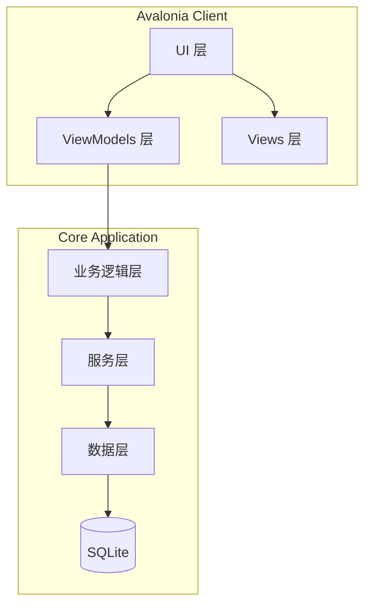

# 基于.NET 10与Avalonia的音乐品味预测系统 —— 开发计划与需求文档 (v2.0)
## 一、项目概述
### 1.1 项目目标
开发一款基于 **.NET 10** 平台的 **Avalonia 跨平台桌面应用程序**，能够：
- 扫描用户本地的音乐文件库
- 提取音频的**专业声学特征**（MFCC、频谱特征等）和**深度学习特征向量**
- 构建用户的**音乐品味特征向量画像**（基于均值向量）
- 对任意输入的新音乐文件，计算其与用户画像的**相似度分数**，预测用户对该音乐的喜好程度
### 1.2 核心功能模块
| 模块 | 功能描述 |
|------|----------|
| 音频扫描与加载 | 扫描指定目录，支持多种音频格式（MP3、WAV、FLAC、M4A等），跨平台兼容 |
| 音频特征提取 | 提取MFCC、频谱质心、色度特征、节奏等专业特征 |
| 深度特征提取 | 使用 ONNX 运行深度学习模型提取音频深度特征向量 |
| 用户画像构建 | 基于用户标记为“喜欢”的歌曲特征，计算均值向量 |
| 相似度预测 | 计算新歌与用户画像的余弦相似度，输出喜好分数 |
| 模型训练（进阶） | 支持训练分类模型（逻辑回归、LightGBM等）进行喜好预测 |
## 二、技术选型
### 2.1 .NET版本与框架
- **目标框架**：**.NET 10.0** (LTS预测版本)
- **应用程序类型**：**Avalonia UI** (跨平台桌面应用，支持 Windows/macOS/Linux)
- **架构模式**：**MVVM 模式** (View + ViewModel + Model)
- **MVVM 框架**：**ReactiveUI (RxUI)** 或 **CommunityToolkit.Mvvm**
### 2.2 核心NuGet包选型
#### UI与跨平台核心
| NuGet包 | 用途 |
|---------|------|
| **Avalonia** | UI框架核心 |
| **Avalonia.Desktop** | 桌面端运行支持 |
| **Avalonia.ReactiveUI** | MVVM 框架集成，命令与属性绑定 |
| **Avalonia.Diagnostics** | 开发调试工具 |
#### 音频处理与特征提取
| NuGet包 | 用途 | 说明 |
|---------|------|------|
| **NWaves** | 音频信号处理与特征提取 | .NET最全面的DSP库，支持FFT、MFCC等 |
| **NAudio.Core** 或 **LibVLCSharp.Avalonia** | 音频解码 | NAudio用于基础解码；LibVLC用于更强的跨平台格式支持及播放 |
#### 深度学习与计算
| NuGet包 | 用途 | 说明 |
|---------|------|------|
| **Microsoft.ML** | 机器学习模型训练 | 微软官方ML框架 |
| **Microsoft.ML.OnnxRuntime** | ONNX模型推理 | 高效运行VGGish等深度模型 |
| **MathNet.Numerics** | 向量运算 | 用于余弦相似度、矩阵计算 |
#### 数据持久化
| NuGet包 | 用途 |
|---------|------|
| **SQLite** | 轻量级本地数据库 |
| **Dapper** 或 **SqlSugar** | ORM，简化数据库操作 |
### 2.3 深度学习模型选型
| 模型 | 用途 | 集成方式 |
|------|------|----------|
| **VGGish (ONNX)** | 音频深度特征提取（128维） | 适用于快速提取通用音频特征 |
| **OpenL3 (ONNX)** | 音乐深度特征提取（512维） | 更适合音乐场景的情感与风格提取 |
## 三、系统架构设计 (Avalonia MVVM)

**层级说明：**
1.  **View (Avalonia XAML)**: 负责界面展示，通过数据绑定与 ViewModel 通信。
2.  **ViewModel (ReactiveUI)**: 负责界面逻辑，处理用户交互命令，调用业务逻辑层服务，实现 `INotifyPropertyChanged`。
3.  **业务逻辑层**: 处理画像构建、相似度计算算法。
4.  **服务层**: 音频解码、特征提取（NWaves/ONNX）。
5.  **数据层**: SQLite 数据库读写。
## 四、详细开发计划
### 阶段一：项目初始化与环境搭建（第1周）
- **任务**：
    1.  创建 .NET 10 Avalonia 解决方案。
    2.  引入 NuGet 包：`Avalonia.ReactiveUI`, `NWaves`, `Microsoft.ML.OnnxRuntime`, `SQLite`。
    3.  搭建基础 MVVM 项目结构。
    4.  设计 SQLite 数据库表结构。
- **输出**：可运行的 Avalonia 空壳项目，数据库脚本。
### 阶段二：音频解码与预处理服务（第2周）
- **任务**：
    1.  封装 `IAudioDecoder` 接口，优先使用 NAudio 处理常见格式，必要时集成 LibVLC 处理特殊格式。
    2.  实现音频重采样与单声道转换。
    3.  编写单元测试。
- **输出**：独立的音频预处理类库。
### 阶段三：特征提取服务（第3-4周）
- **任务**：
    1.  **专业特征**：使用 NWaves 实现 MFCC、频谱质心、BPM 等特征提取。
    2.  **深度特征**：集成 ONNX Runtime，加载 VGGish 模型，实现音频切片 -> 梅尔频谱 -> 推理 -> 聚合 的全流程。
    3.  **特征标准化**：实现 Z-Score 归一化。
- **输出**：`FeatureExtractor` 服务，包含声学特征和深度特征向量。
### 阶段四：用户画像构建服务（第5周）
- **任务**：
    1.  实现“喜欢”歌曲的标记与管理（数据持久化）。
    2.  计算用户画像：遍历“喜欢”列表，计算特征向量的均值。
    3.  实现画像的增量更新算法（新增喜欢歌曲时更新均值）。
- **输出**：`UserProfile` 实体类及 `ProfileService`。
### 阶段五：相似度计算与预测（第6周）
- **任务**：
    1.  使用 MathNet 实现余弦相似度算法。
    2.  实现加权评分：`总分 = 0.4 * 声学特征相似度 + 0.6 * 深度特征相似度`（权重可配置）。
    3.  实现预测服务接口。
- **输出**：`PredictionService`，返回 0-100 的评分。
### 阶段六：Avalonia UI 界面开发（第7-9周）
*此阶段重点在于 MVVM 模式的实现*
- **任务**：
    1.  **主界面**：音乐库列表视图，使用 `DataGrid` 展示歌曲信息。
    2.  **交互逻辑**：实现“扫描文件夹”功能，异步加载，不阻塞 UI 线程（使用 `ReactiveCommand`）。
    3.  **标记功能**：列表中的“爱心”按钮，绑定 ViewModel 中的 `ToggleLikeCommand`。
    4.  **预测界面**：拖拽上传新音乐，实时显示“匹配度”进度条和分数。
    5.  **设置界面**：调整特征权重、选择模型路径。
- **输出**：完整的 Avalonia 界面，用户体验流畅。
### 阶段七：集成测试与性能优化（第10周）
- **任务**：
    1.  端到端测试：扫描 -> 标记 -> 预测。
    2.  性能优化：特征提取耗时较长，需使用 `Task.Run` 在后台线程运行，并通过 ViewModel 通知 UI 进度。
    3.  跨平台测试（在 Windows 和 Linux/macOS 上验证音频解码是否正常）。
## 五、关键技术实现代码示例 (Avalonia & .NET 10)
### 5.1 Avalonia ViewModel 示例 (使用 ReactiveUI)
```csharp
using ReactiveUI;
using System.Reactive;
using System.Threading.Tasks;
public class MusicLibraryViewModel : ViewModelBase
{
    private readonly AudioService _audioService;
    private string _statusMessage;
    private int _progressValue;
    public string StatusMessage
    {
        get => _statusMessage;
        set => this.RaiseAndSetIfChanged(ref _statusMessage, value);
    }
    public int ProgressValue
    {
        get => _progressValue;
        set => this.RaiseAndSetIfChanged(ref _progressValue, value);
    }
    // 定义命令，绑定到按钮
    public ReactiveCommand<Unit, Unit> ScanLibraryCommand { get; }
    public MusicLibraryViewModel(AudioService audioService)
    {
        _audioService = audioService;
        
        // 初始化命令，指定异步执行逻辑
        ScanLibraryCommand = ReactiveCommand.CreateFromTask(ExecuteScan);
    }
    private async Task ExecuteScan()
    {
        StatusMessage = "正在扫描...";
        await _audioService.ProcessLibraryAsync(path => 
        {
            ProgressValue = path; // 更新进度，UI会自动响应
        });
        StatusMessage = "扫描完成";
    }
}
```
### 5.2 特征提取核心逻辑
```csharp
public float[] ExtractCombinedFeatures(string filePath)
{
    // 1. 解码音频
    var audioSamples = _decoder.Decode(filePath);
    
    // 2. 提取声学特征 => _nwavesExtractor.Extract(audioSamples);
    var acousticVector = _aggregator.Aggregate(mfccFeatures); // 聚合为均值向量
    // 3. 提取深度特征 => _onnxExtractor.Extract(audioSamples);
    
    // 4. 拼接向量 => acousticVector.Concat(deepVector).ToArray();
}
```
### 5.3 数据库 Schema (SQLite)
```sql
CREATE TABLE Songs (
    Id INTEGER PRIMARY KEY AUTOINCREMENT,
    FilePath TEXT UNIQUE NOT NULL,
    Title TEXT,
    Artist TEXT,
    IsLiked INTEGER DEFAULT 0, -- SQLite 使用 0/1 存储 Boolean
    AcousticVector BLOB, -- 存储声学特征数组
    DeepVector BLOB      -- 存储深度特征数组
);
CREATE TABLE UserProfile (
    Id INTEGER PRIMARY KEY,
    AcousticMeanVector BLOB,
    DeepMeanVector BLOB,
    LastUpdated DATETIME
);
```
## 六、项目结构建议
```text
/src
  /App.Core              # 核心业务逻辑 (可移植类库)
    /Services            # 特征提取、相似度计算
    /Models              # 数据模型
    /Interfaces          # 接口定义
  /App.Data              # 数据访问层
    /Repositories
    /DbContext
  /App.UI                # Avalonia UI 项目
    /ViewModels          # MVVM ViewModels
    /Views               # Avalonia XAML 视图
    /Styles              # 样式资源
  /App.Desktop           # 程序入口点 (Windows/Linux/Mac)
```
## 七、总结
本方案保留了原有的优秀算法逻辑（向量化 + 均值画像），将底层架构升级为 **.NET 10** 和 **Avalonia**，并引入了 **MVVM (ReactiveUI)** 模式，确保了应用程序在未来的兼容性、跨平台能力以及代码的可维护性。
---
*文档版本：2.0*
*更新日期：2026年*
*适配技术：.NET 10, Avalonia UI, ReactiveUI*
