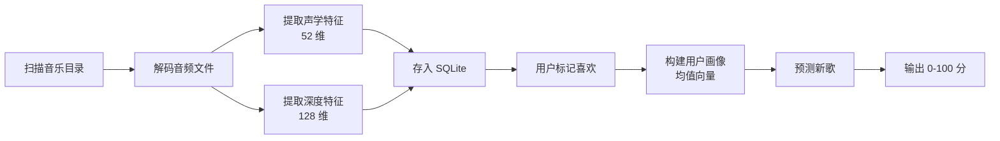

# 01 · 项目介绍

> 返回 [Wiki 首页](Home) · 下一章 [02-快速开始](02-快速开始)

---

## 1.1 项目背景

"Find My Favourite Music" 是一款**本地优先**的音乐品味预测系统。面对日益庞大的个人音乐库，用户常常面临"收藏了很多歌却不知道下一首该听什么"的困扰。本项目的目标是：

- **不依赖云端**：所有音频解码、特征提取、画像构建均在本地完成，保护用户隐私
- **个性化预测**：基于用户自己标记的"喜欢"歌曲构建品味画像，预测新歌的匹配度
- **可解释性**：分数由声学相似度与深度相似度加权得出，每一步都可追溯

---

## 1.2 核心能力

| 能力 | 说明 |
|------|------|
| 🎵 音乐库管理 | 扫描本地目录，自动提取音频特征并存入 SQLite |
| 🎚️ 声学特征提取 | MFCC + 频谱质心 + 色度，共 **52 维**向量 |
| 🧠 深度特征提取 | 基于 VGGish ONNX 模型，**128 维**向量（可选） |
| 👤 用户画像构建 | 从"喜欢"歌曲聚合均值向量，支持 **Welford 增量更新** |
| 🎯 喜好预测 | 余弦相似度 + 加权评分，输出 **0–100 匹配度** |
| 🖥️ 跨平台 UI | Avalonia MVVM，支持 Windows / macOS / Linux |

---

## 1.3 技术选型

### 运行时与 UI

| 技术 | 版本 | 用途 |
|------|------|------|
| .NET | 10 | 目标框架（LTS） |
| Avalonia UI | 12.0.5 | 跨平台桌面 UI 框架 |
| CommunityToolkit.Mvvm | 8.4.1 | MVVM 源生成器（`[ObservableProperty]` / `[RelayCommand]`） |

### 音频与算法

| 技术 | 版本 | 用途 |
|------|------|------|
| NAudio | 2.3.0 | 音频解码（WAV/MP3 跨平台，FLAC/M4A 仅 Windows） |
| NWaves | 0.9.6 | 信号处理（MFCC、频谱质心、色度） |
| Microsoft.ML.OnnxRuntime | 1.22.0 | ONNX 模型推理（VGGish） |

### 数据与基础设施

| 技术 | 版本 | 用途 |
|------|------|------|
| Microsoft.Data.Sqlite | 9.0.5 | SQLite ADO.NET 提供程序 |
| Dapper | 2.1.66 | 轻量级 ORM |
| Microsoft.Extensions.Hosting | 9.0.5 | 依赖注入 + 配置 + 日志 + IHostedService |

> 所有 NuGet 包版本集中在 `src/Directory.Packages.props`，启用 [Central Package Management](https://learn.microsoft.com/dotnet/core/tools/dependencies#central-package-management)。

---

## 1.4 支持的音频格式

| 格式 | 扩展名 | Windows | macOS | Linux |
|------|--------|---------|-------|-------|
| WAV | `.wav` | ✅ | ✅ | ✅ |
| MP3 | `.mp3` | ✅ | ✅ | ✅ |
| FLAC | `.flac` | ✅ | ❌ | ❌ |
| M4A | `.m4a` | ✅ | ❌ | ❌ |

> FLAC/M4A 依赖 Windows Media Foundation 系统解码器，非 Windows 平台无法解码。详见 [08-常见问题](08-常见问题)。

---

## 1.5 工作流程概览



---

## 1.6 项目结构

```
src/
├── FindMyFavouriteMusic.Core/       # 核心算法：音频解码、特征提取、相似度计算
├── FindMyFavouriteMusic.Services/   # 业务服务：音乐库管理、画像构建、预测编排
├── FindMyFavouriteMusic.Models/     # 数据模型：实体、DTO、Result 模式
├── FindMyFavouriteMusic.GUI/        # Avalonia UI：ViewModel、View、转换器
└── FindMyFavouriteMusic.Tests/      # 单元测试：Core 算法 + Services 业务
```

各项目的详细职责见 [03-架构设计](03-架构设计)。

---

## 1.7 命名空间约定

所有项目代码统一使用命名空间前缀 `Larpx.PersonalTools.FindMyFavouriteMusic.*`，由 `src/Directory.Build.props` 自动拼接：

```xml
<RootNamespace>Larpx.PersonalTools.$(MSBuildProjectName)</RootNamespace>
```

例如：
- `FindMyFavouriteMusic.Core` → `Larpx.PersonalTools.FindMyFavouriteMusic.Core`
- `FindMyFavouriteMusic.GUI` → `Larpx.PersonalTools.FindMyFavouriteMusic.GUI`

---

## 1.8 适用场景

- **个人音乐爱好者**：拥有本地音乐库，希望发现符合自己口味的新歌
- **算法学习者**：想了解 MFCC、VGGish、Welford 算法、余弦相似度在实际项目中的应用
- **.NET 开发者**：参考 Avalonia MVVM + 依赖注入 + SQLite 的完整桌面应用架构
- **二次开发者**：希望扩展新的音频格式、特征提取器或相似度算法

---

> 📖 下一章：[02-快速开始](02-快速开始) · 返回 [Wiki 首页](Home)
