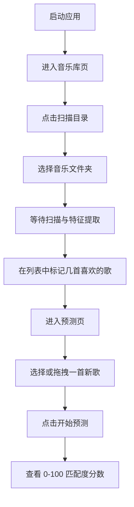

# 02 · 快速开始

> 返回 [Wiki 首页](Home) · 上一章 [01-项目介绍](01-项目介绍) · 下一章 [03-架构设计](03-架构设计)

---

## 2.1 环境要求

### 必需

- **.NET 10 SDK**（项目 `TargetFramework` 为 `net10.0`，`LangVersion` 为 `preview`）
- 操作系统：Windows 10+ / macOS / Linux（桌面环境）

### 验证 .NET 安装

```bash
dotnet --version
# 应输出 10.x.x
```

> 若未安装，前往 [.NET 官网](https://dotnet.microsoft.com/download) 下载 .NET 10 SDK。

### 可选

- **VGGish ONNX 模型文件**：用于启用深度特征提取，提升预测精度。无此文件时系统以"仅声学"模式运行，详见 [07-扩展开发 · ONNX 模型集成](07-扩展开发#onnx-模型集成)。

---

## 2.2 获取源码

```bash
# Gitee
git clone https://gitee.com/DLarpx/find-my-favourite-music.git

# 或 GitHub
git clone https://github.com/Larpx/FindMyFavouriteMusic.git

cd find-my-favourite-music
```

---

## 2.3 构建项目

项目使用 Central Package Management，所有 NuGet 版本集中在 `src/Directory.Packages.props`，无需手动指定版本。

```bash
cd src
dotnet build
```

### 构建要求

- **0 错误、0 警告**（`TreatWarningsAsErrors` 已开启）
- 构建产物默认输出到 `src/{Project}/bin/Debug/net10.0/`
- GUI 项目输出类型为 `WinExe`，产物为 `FindMyFavouriteMusic.GUI.dll`（Windows 下为 `.exe`）
- `appsettings.json` 会被自动复制到输出目录

---

## 2.4 运行应用

### 命令行启动

```bash
# 方式一：指定项目运行
dotnet run --project src/FindMyFavouriteMusic.GUI

# 方式二：进入项目目录运行
cd src/FindMyFavouriteMusic.GUI
dotnet run
```

### 首次运行行为

1. **自动建库**：`DatabaseInitializer`（`IHostedService`）在启动时创建 SQLite 数据库文件 `findmyfavouritemusic.db`，位于 GUI 输出目录
2. **幂等建表**：使用 `CREATE TABLE IF NOT EXISTS`，重复启动不会破坏已有数据
3. **模型加载**（可选）：若 `OnnxModel.EnableDeepFeatures` 为 `true` 且指定了模型路径，会尝试自动加载 VGGish 模型；加载失败仅记录警告，不影响应用启动

### 全局异常处理

`Program.cs` 注册了 `AppDomain.UnhandledException` 和 `TaskScheduler.UnobservedTaskException` 两个全局异常处理器，避免未处理异常导致应用静默崩溃。

---

## 2.5 首次使用流程

应用主窗口左侧为导航栏，包含三个功能页：**音乐库 / 预测 / 设置**。



### 步骤详解

#### Step 1 · 扫描音乐库

1. 进入"音乐库"页
2. 点击"扫描目录"按钮
3. 在弹出的文件夹选择对话框中选中你的音乐文件夹
4. 系统递归扫描所有支持的音频文件（`.mp3 / .wav / .flac / .m4a`）
5. 每个文件依次执行：解码 → 提取声学特征 →（可选）提取深度特征 → 存入数据库
6. 进度条实时显示扫描进度

#### Step 2 · 标记喜欢的歌

- 每首歌曲右侧显示爱心图标：`♡`（未喜欢）/ `♥`（已喜欢）
- 点击图标切换喜欢状态
- **标记喜欢**会触发画像增量更新（Welford 算法，O(D) 时间）
- 建议至少标记 **5–10 首**，画像才有代表性

#### Step 3 · 预测新歌

1. 进入"预测"页
2. 选择音乐文件：点击"选择文件"按钮，或**直接拖拽文件**到放置区
3. 点击"开始预测"
4. 查看结果：
   - **总分**（0–100）：加权后的匹配度
   - **声学得分**：仅声学特征的相似度
   - **深度得分**：仅深度特征的相似度（若启用）
   - **当前模式**：`声学模式` 或 `深度增强模式`

#### Step 4 ·（可选）启用深度特征

若你已获取 VGGish ONNX 模型文件：

1. 进入"设置"页
2. 在"ONNX 模型路径"输入框填入模型绝对路径
3. 勾选"启用深度特征"
4. 点击"保存 ONNX 配置"（写入 `usersettings.json`）
5. 点击"加载模型"（立即加载到内存，无需重启）
6. 模型加载成功后，预测页会显示"深度增强模式"

---

## 2.6 运行单元测试

```bash
cd src
dotnet test
```

预期输出：38 个测试全部通过（13 个 Core 算法测试 + 25 个 Services 业务测试）。

---

## 2.7 下一步

- 📖 了解系统架构：[03-架构设计](03-架构设计)
- 🔬 深入算法原理：[04-算法原理](04-算法原理)
- 💡 完整功能说明：[05-功能使用](05-功能使用)
- ⚙️ 配置项详解：[06-配置说明](06-配置说明)

---

> 返回 [Wiki 首页](Home) · 上一章 [01-项目介绍](01-项目介绍) · 下一章 [03-架构设计](03-架构设计)
