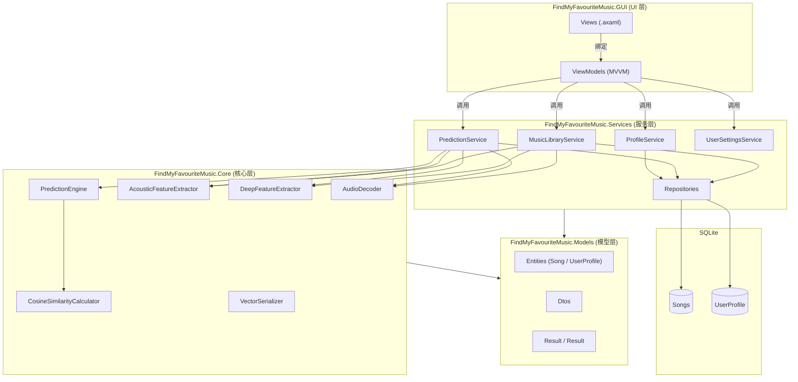
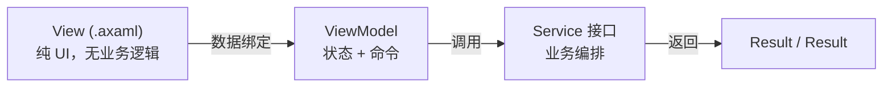
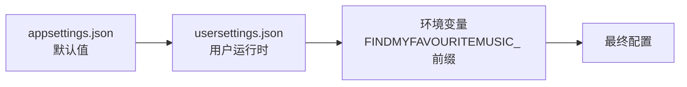
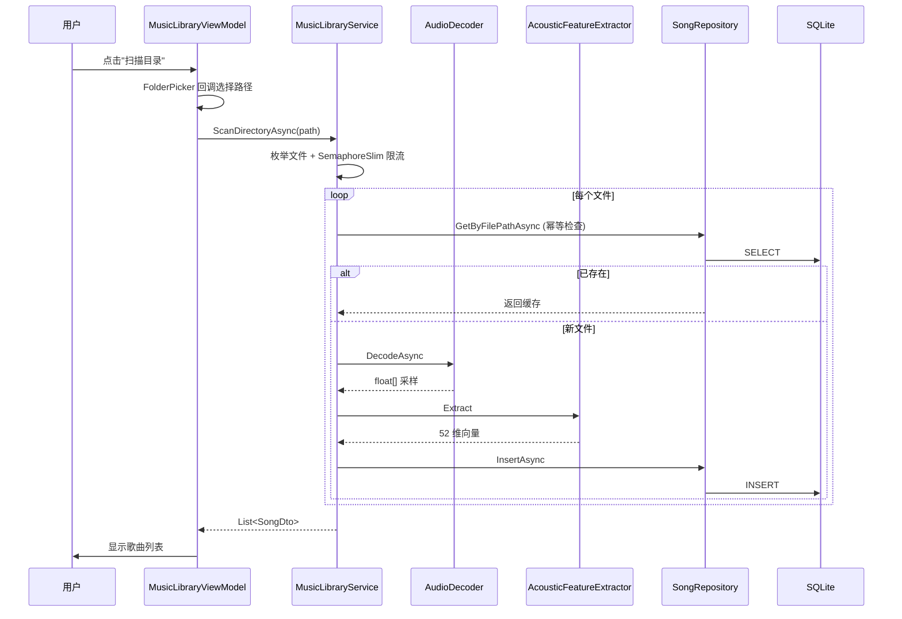
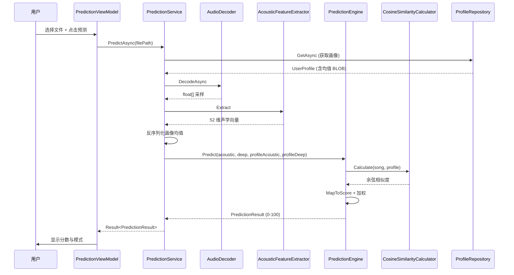
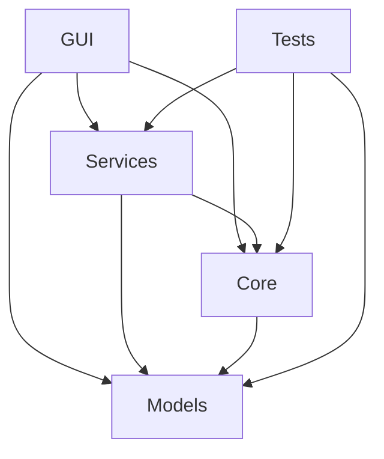

# 03 · 架构设计

> 返回 [Wiki 首页](Home) · 上一章 [02-快速开始](02-快速开始) · 下一章 [04-算法原理](04-算法原理)

---

## 3.1 分层架构

系统采用**分层架构**，自下而上分为四层，各层通过接口与依赖注入解耦，禁止跨层调用。



### 层级职责

| 层 | 项目 | 职责 | 依赖 |
|----|------|------|------|
| **UI 层** | `GUI` | Avalonia XAML 视图、ViewModel、值转换器 | Core、Services、Models |
| **服务层** | `Services` | 业务编排、SQLite 仓储、用户设置持久化 | Core、Models |
| **核心层** | `Core` | 音频解码、特征提取、相似度计算、向量序列化 | Models |
| **模型层** | `Models` | 实体、DTO、枚举、Result 模式 | 无（最底层） |

---

## 3.2 MVVM 模式

UI 层采用 **MVVM（Model-View-ViewModel）** 模式，基于 `CommunityToolkit.Mvvm` 源生成器实现。



### View（视图）

- `*.axaml` 文件，仅声明 UI 结构与数据绑定
- Code-behind（`*.axaml.cs`）只处理纯 UI 交互（如文件对话框、拖拽事件），不直接调用服务
- 通过 `ContentControl` + `DataTemplate` 实现页面切换

### ViewModel（视图模型）

- 继承 `ViewModelBase`（继承 `ObservableObject`）
- 使用 `[ObservableProperty]` 源生成器声明可观察属性（自动生成 public 属性 + `INotifyPropertyChanged`）
- 使用 `[RelayCommand]` 源生成器声明命令（自动生成 `ICommand`）
- 通过构造函数注入服务接口
- **不直接依赖 Avalonia 平台 API**：文件选择等交互通过 `Func<Task<string?>>` 回调注入，便于测试

### 示例

```csharp
// src/FindMyFavouriteMusic.GUI/ViewModels/MusicLibraryViewModel.cs
public partial class MusicLibraryViewModel : ViewModelBase
{
    private readonly IMusicLibraryService _libraryService;

    // 源生成器会生成 public ObservableCollection<SongDto> Songs 属性
    [ObservableProperty]
    private ObservableCollection<SongDto> _songs = [];

    // 源生成器会生成 ScanDirectoryCommand
    [RelayCommand]
    private async Task ScanDirectoryAsync() { /* ... */ }
}
```

---

## 3.3 依赖注入

应用入口 `App.axaml.cs` 使用 `Microsoft.Extensions.Hosting` 构建 DI 容器。

### 配置源加载



**优先级**（从高到低）：环境变量 > `usersettings.json` > `appsettings.json`

### 服务注册

```csharp
// src/FindMyFavouriteMusic.GUI/App.axaml.cs
return Host.CreateDefaultBuilder()
    .ConfigureAppConfiguration((context, config) =>
    {
        config.AddJsonFile("appsettings.json", optional: true, reloadOnChange: true);
        config.AddJsonFile("usersettings.json", optional: true, reloadOnChange: true);
        config.AddEnvironmentVariables("FINDMYFAVOURITEMUSIC_");
    })
    .ConfigureServices((context, services) =>
    {
        // 配置项绑定
        services.Configure<FeatureExtractionOptions>(context.Configuration.GetSection(...));
        // ...

        // Core 层（单例）
        services.AddSingleton<IAudioDecoder, AudioDecoder>();
        services.AddSingleton<IAcousticFeatureExtractor, AcousticFeatureExtractor>();
        // ...

        // Services 层（单例）
        services.AddSingleton<IProfileService, ProfileService>();
        services.AddSingleton<IPredictionService, PredictionService>();
        // ...

        // Hosted Service：数据库初始化
        services.AddHostedService(sp => sp.GetRequiredService<DatabaseInitializer>());

        // ViewModels（瞬态）
        services.AddTransient<MainWindowViewModel>();
        // ...
    })
    .Build();
```

### 生命周期策略

| 生命周期 | 适用对象 | 原因 |
|----------|----------|------|
| **Singleton** | Core 算法组件、Repositories、Services | 无状态或线程安全，复用实例节省内存 |
| **Transient** | ViewModels | 每次导航创建新实例，避免状态污染 |
| **HostedService** | `DatabaseInitializer` | 应用启动时执行一次建表 |

---

## 3.4 数据流

### 扫描入库流程



### 预测流程



---

## 3.5 数据库设计

### 表结构

**Songs 表**（歌曲记录）

| 列名 | 类型 | 约束 | 说明 |
|------|------|------|------|
| `Id` | INTEGER | PRIMARY KEY AUTOINCREMENT | 自增主键 |
| `FilePath` | TEXT | UNIQUE NOT NULL | 文件绝对路径（幂等保证） |
| `Title` | TEXT | | 歌曲标题（默认取文件名） |
| `Artist` | TEXT | | 艺术家（当前未提取） |
| `IsLiked` | INTEGER | DEFAULT 0 | 是否喜欢（0/1） |
| `AcousticVector` | BLOB | | 52 维声学特征向量 |
| `DeepVector` | BLOB | | 128 维深度特征向量 |

**UserProfile 表**（用户画像，单行表）

| 列名 | 类型 | 约束 | 说明 |
|------|------|------|------|
| `Id` | INTEGER | PRIMARY KEY | 固定为 1（单画像） |
| `AcousticMeanVector` | BLOB | | 声学特征均值向量 |
| `DeepMeanVector` | BLOB | | 深度特征均值向量 |
| `LastUpdated` | DATETIME | | 最后更新时间 |

### 建表 SQL

```sql
CREATE TABLE IF NOT EXISTS Songs (
    Id INTEGER PRIMARY KEY AUTOINCREMENT,
    FilePath TEXT UNIQUE NOT NULL,
    Title TEXT,
    Artist TEXT,
    IsLiked INTEGER DEFAULT 0,
    AcousticVector BLOB,
    DeepVector BLOB
);

CREATE TABLE IF NOT EXISTS UserProfile (
    Id INTEGER PRIMARY KEY,
    AcousticMeanVector BLOB,
    DeepMeanVector BLOB,
    LastUpdated DATETIME
);
```

### 向量存储

特征向量通过 `VectorSerializer` 在 `float[]` 与 `byte[]` 间零拷贝转换（`MemoryMarshal`），存为 BLOB：

| 向量 | 维度 | 存储开销 |
|------|------|----------|
| 声学向量 | 52 | 208 字节/歌曲 |
| 深度向量 | 128 | 512 字节/歌曲 |
| 画像均值 | 52 + 128 | 720 字节 |

---

## 3.6 错误处理：Result 模式

系统采用 **Result 模式**（而非异常）传递可预期的失败，避免异常的性能开销与控制流跳跃。

```csharp
// src/FindMyFavouriteMusic.Models/Results/Result.cs
public class Result
{
    public bool IsSuccess { get; }
    public string? Error { get; }
    public Exception? Exception { get; }

    public static Result Success() => new(true, null, null);
    public static Result Failure(string error, Exception? exception = null) => new(false, error, exception);
    public static Result Failure(Exception exception) => new(false, exception.Message, exception);
}

// src/FindMyFavouriteMusic.Models/Results/ResultT.cs
public class Result<T> : Result
{
    public T? Value { get; }
    public static Result<T> Success(T value) => new(true, value, null, null);
    public static new Result<T> Failure(string error, Exception? exception = null) => new(false, default, error, exception);
}
```

### 使用约定

- **可预期失败**（文件不存在、格式不支持、画像未构建）→ 返回 `Result.Failure`
- **不可预期异常**（NullReference、OutOfMemory）→ 捕获并包装为 `Result.Failure(ex)`
- **UI 层**根据 `IsSuccess` 显示成功或错误消息，**不暴露 `ex.Message`** 给最终用户

---

## 3.7 全局异常处理

`Program.cs` 注册了两层全局异常兜底：

```csharp
// src/FindMyFavouriteMusic.GUI/Program.cs
AppDomain.CurrentDomain.UnhandledException += OnUnhandledException;
TaskScheduler.UnobservedTaskException += OnUnobservedTaskException;
```

- `AppDomain.UnhandledException`：捕获所有未处理异常，记录到 Trace
- `TaskScheduler.UnobservedTaskException`：捕获未观察的 Task 异常，标记为已观察避免进程崩溃

---

## 3.8 项目依赖关系



- `Models` 是最底层，无任何项目依赖
- `Core` 仅依赖 `Models`
- `Services` 依赖 `Core` 和 `Models`
- `GUI` 依赖所有三层（组装 DI 容器）
- `Tests` 依赖被测项目

---

> 返回 [Wiki 首页](Home) · 上一章 [02-快速开始](02-快速开始) · 下一章 [04-算法原理](04-算法原理)
