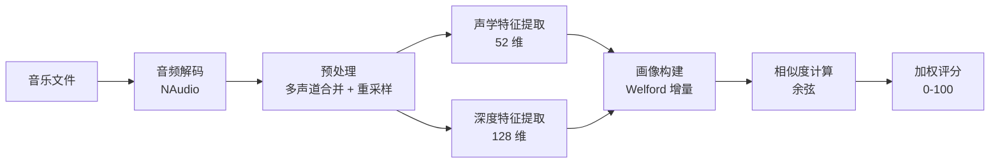

# 04 · 算法原理

> 返回 [Wiki 首页](Home) · 上一章 [03-架构设计](03-架构设计) · 下一章 [05-功能使用](05-功能使用)

本章详细说明从音频文件到匹配度分数的完整算法链路。所有内容均基于 `src/` 目录下的实际源码撰写。

> 📚 若需更详尽的算法说明（含完整代码与复杂度分析），请参阅仓库 `docs/算法说明.md`。

---

## 4.1 算法总览



| 阶段 | 输入 | 输出 | 关键算法 |
|------|------|------|----------|
| 解码 | 音频文件 | float[] 采样 | NAudio + 位深度归一化 |
| 预处理 | float[] 多声道 | float[] 16kHz 单声道 | 均值合并 + 线性插值 |
| 声学特征 | float[] 采样 | 52 维向量 | MFCC + 频谱质心 + 色度 |
| 深度特征 | float[] 采样 | 128 维向量 | VGGish ONNX 推理 |
| 画像构建 | N 个特征向量 | 1 个均值向量 | Welford 在线算法 |
| 相似度 | 2 个向量 | [-1, 1] | 余弦相似度 |
| 评分 | 相似度 | [0, 100] | 线性映射 + 加权 |

---

## 4.2 音频解码与预处理

### 4.2.1 格式识别与 Reader 选择

`AudioFormatDetector` 通过文件扩展名映射到 `AudioFormat` 枚举，`AudioDecoder` 根据格式选择 NAudio Reader：

| 格式 | Reader | 平台 |
|------|--------|------|
| WAV | `WaveFileReader` | 跨平台 |
| MP3 | `Mp3FileReader` | 跨平台 |
| FLAC | `MediaFoundationReader` | 仅 Windows |
| M4A | `MediaFoundationReader` | 仅 Windows |

### 4.2.2 PCM 字节转浮点采样

NAudio 读取的 PCM 字节流需按位深度归一化到 `[-1, 1]`：

- **16 位**：`Int16 / 32768`（2^15）
- **24 位**：手动拼接 3 字节小端序 + 符号位扩展，`/ 8388608`（2^23）
- **32 位**：`Int32 / 2147483648`（2^31）

### 4.2.3 多声道合并

将立体声等多声道采样按帧取算术平均，得到单声道：

$$
\text{mono}[i] = \frac{1}{C} \sum_{ch=0}^{C-1} \text{samples}[i \times C + ch]
$$

### 4.2.4 线性插值重采样

当源采样率与目标（默认 16000 Hz）不一致时，使用线性插值：

$$
\text{output}[i] = \text{samples}[\text{index1}] \times (1 - f) + \text{samples}[\text{index2}] \times f
$$

其中 `index1 = floor(i × ratio)`，`f` 为小数部分。

> **为何选线性插值？** 计算量最小，下游 MFCC/Mel 特征以 16 kHz 为目标，对极高频不敏感，精度足够。

---

## 4.3 声学特征提取（52 维）

基于 [NWaves](https://github.com/ar1st0crat/NWaves) 信号处理库，输出 **52 维**向量。

### 4.3.1 整体流程

```mermaid
flowchart LR
    A[float[] 采样] --> B[分帧 FFT=512]
    B --> C1[MfccExtractor<br/>13 维/帧]
    B --> C2[SpectralFeaturesExtractor<br/>1 维/帧]
    B --> C3[ChromaExtractor<br/>12 维/帧]
    C1 --> D1[聚合 26 维]
    C2 --> D2[聚合 2 维]
    C3 --> D3[聚合 24 维]
    D1 --> E[拼接 52 维]
    D2 --> E
    D3 --> E
```

### 4.3.2 MFCC（梅尔频率倒谱系数）

**原理**：模拟人耳对频率的非线性感知。Mel 频率尺度将线性频率映射到与人耳感知线性相关的尺度：

$$
\text{mel}(f) = 2595 \times \log_{10}\left(1 + \frac{f}{700}\right)
$$

**提取流程**（NWaves 内部完成）：

1. 预加重 → 2. 分帧（25ms 帧，10ms 帧移）→ 3. 加汉明窗 → 4. FFT → 5. 梅尔滤波器组（26 个）→ 6. 对数变换 → 7. DCT 取前 13 系数

**输出**：每帧 13 维，聚合后 26 维（13 均值 + 13 方差）。

### 4.3.3 频谱质心（Spectral Centroid）

描述频谱能量的"重心"频率，衡量声音"亮度"：

$$
\text{SC} = \frac{\sum_{k} f(k) \cdot |X(k)|}{\sum_{k} |X(k)|}
$$

**输出**：每帧 1 维，聚合后 2 维。

### 4.3.4 色度特征（Chroma）

将频谱能量按 **12 个音高类**（C, C#, ..., B）汇总，反映音调与和声内容，对八度变化不敏感。

**输出**：每帧 12 维，聚合后 24 维。

### 4.3.5 帧级特征聚合

`FeatureAggregator` 将 $T$ 帧、每帧 $D$ 维的特征矩阵压缩为 $2D$ 维向量：

$$
\mu_d = \frac{1}{T} \sum_{t=0}^{T-1} x_{t,d}, \quad \sigma_d^2 = \frac{1}{T} \sum_{t=0}^{T-1} (x_{t,d} - \mu_d)^2
$$

> **为何用均值 + 方差？** 均值反映"典型状态"，方差反映"动态变化范围"。仅用均值会丢失节奏信息。

### 4.3.6 最终 52 维向量构成

| 子特征 | 聚合后维度 | 含义 |
|--------|-----------|------|
| MFCC | 26 | 音色包络（人耳感知） |
| 频谱质心 | 2 | 声音亮度 |
| 色度 | 24 | 音调/和声内容 |
| **合计** | **52** | |

---

## 4.4 深度特征提取（128 维）

基于 [VGGish](https://github.com/tensorflow/models/tree/master/research/audioset/vggish) ONNX 模型，输出 **128 维**向量。VGGish 在 AudioSet 大规模数据集上预训练，能捕获 MFCC 难以表达的高层语义（乐器、人声、环境音）。

### 4.4.1 推理流水线

```mermaid
flowchart LR
    A[float[] 采样] --> B[分帧 0.96s/帧<br/>50% 重叠]
    B --> C[log-mel 频谱图<br/>96×64]
    C --> D[构造张量<br/>1,1,96,64]
    D --> E[ONNX 推理]
    E --> F[帧级 128 维]
    F --> G[时间维均值]
    G --> H[128 维向量]
```

### 4.4.2 分帧策略

- **帧长**：0.96 秒（VGGish 标准输入）
- **帧移**：0.48 秒（50% 重叠，避免边界信息丢失）

### 4.4.3 log-mel 频谱图

每帧 0.96 秒音频转换为 `96 × 64` 的 log-mel 频谱图（96 时间步 × 64 Mel 频带）。

**Mel 频率逆映射**：

$$
f = 700 \times \left(e^{\text{mel}/1127} - 1\right)
$$

### 4.4.4 帧级均值聚合

所有帧的 128 维输出按维度取时间均值：

$$
\text{agg}_d = \frac{1}{N} \sum_{t=0}^{N-1} \text{frame}_{t,d}, \quad d \in [0, 127]
$$

### 4.4.5 优雅降级

- 无 ONNX 模型时 `IsModelLoaded` 为 `false`
- 调用 `ExtractAsync` 直接返回失败结果
- 上层 `PredictionEngine` 自动切换为"仅声学模式"

---

## 4.5 用户画像构建

画像本质是"用户喜欢的所有歌曲特征向量的均值向量"。

### 4.5.1 全量重建（Rebuild）

遍历所有 `IsLiked = 1` 的歌曲，逐维度求均值：

$$
\mu_d = \frac{1}{N} \sum_{i=0}^{N-1} v_{i,d}
$$

**触发时机**：取消喜欢、画像不存在、用户手动重建。

### 4.5.2 增量更新（Welford 在线算法）

在已有画像基础上，仅用新加入的歌曲向量更新均值，复杂度 $O(D)$ 而非 $O(N \cdot D)$：

$$
\mu_{\text{new}} = \mu_{\text{old}} + \frac{v_{\text{new}} - \mu_{\text{old}}}{n_{\text{new}}}
$$

```csharp
// 简化伪代码
for (var i = 0; i < dimension; i++)
{
    result[i] = currentMean[i] + (newVector[i] - currentMean[i]) / newCount;
}
```

> **算法优点**：单次更新只需保存当前均值与计数，无需保留全部历史样本；数值稳定性优于"先累加再除"。

### 4.5.3 触发策略

| 操作 | 调用方法 | 复杂度 |
|------|----------|--------|
| 标记喜欢 | `UpdateProfileIncrementalAsync` | $O(D)$ |
| 取消喜欢 | `RebuildProfileAsync` | $O(N \cdot D)$ |
| 设置页重建 | `RebuildProfileAsync` | $O(N \cdot D)$ |

> **为何取消喜欢要全量重建？** Welford 算法只能"加"不能"减"，无法从均值中移除一个样本。

---

## 4.6 相似度计算与预测

### 4.6.1 余弦相似度

衡量两个向量的方向一致性，不受向量长度影响：

$$
\cos(A, B) = \frac{A \cdot B}{\|A\| \times \|B\|} = \frac{\sum_{i=0}^{D-1} a_i b_i}{\sqrt{\sum_{i=0}^{D-1} a_i^2} \times \sqrt{\sum_{i=0}^{D-1} b_i^2}}
$$

**取值范围**：$[-1, 1]$，1 表示方向完全一致，0 表示正交，-1 表示方向相反。

**边界处理**：维度不一致返回失败；零向量返回 0（避免除零）。

### 4.6.2 分数映射

余弦相似度 $[-1, 1]$ 线性映射到 $[0, 100]$：

$$
\text{score} = \frac{\text{similarity} + 1}{2} \times 100
$$

| 相似度 | 分数 | 含义 |
|--------|------|------|
| 1 | 100 | 完全匹配 |
| 0 | 50 | 无相关性 |
| -1 | 0 | 完全相反 |

### 4.6.3 加权评分

**声学 + 深度模式**（模型已加载且双方有深度向量）：

$$
\text{Score}_{\text{total}} = w_a \cdot \text{Score}_{\text{acoustic}} + w_d \cdot \text{Score}_{\text{deep}}
$$

默认 $w_a = 0.4$、$w_d = 0.6$（深度特征权重更高，因含高层语义）。

**仅声学模式**（降级）：

$$
\text{Score}_{\text{total}} = w_{\text{ao}} \cdot \text{Score}_{\text{acoustic}}
$$

默认 $w_{\text{ao}} = 1.0$。

### 4.6.4 预测模式判定

| 条件 | 模式 | 公式 |
|------|------|------|
| 模型已加载 且 双方有深度向量 | `AcousticAndDeep` | $0.4 S_a + 0.6 S_d$ |
| 上述任一不满足 | `AcousticOnly` | $1.0 S_a$ |
| 深度相似度计算失败 | `AcousticOnly`（降级） | $1.0 S_a$ |

最终分数用 `Math.Clamp` 截断到 $[0, 100]$。

---

## 4.7 向量序列化

`VectorSerializer` 通过 `MemoryMarshal` 实现 `float[]` 与 `byte[]` 间的**零拷贝**转换：

- `float` 占 4 字节，`float[]` 内存布局与 `byte[]` 等价（小端序）
- `MemoryMarshal.AsBytes` 将 `Span<float>` 重新解释为 `Span<byte>`，无需逐元素拷贝

| 向量 | 维度 | 存储开销 |
|------|------|----------|
| 声学向量 | 52 | 208 字节/歌曲 |
| 深度向量 | 128 | 512 字节/歌曲 |

---

## 4.8 Z-Score 归一化（默认关闭）

将特征向量归一化为均值 0、标准差 1：

$$
z_i = \frac{x_i - \mu}{\sigma}
$$

**默认关闭**（`EnableNormalization = false`）的原因：

1. **异构特征尺度差异**：52 维向量是三类异构特征拼接，整体 Z-Score 会破坏原有尺度信息
2. **余弦相似度的尺度不变性**：余弦相似度本身对向量长度不敏感，归一化反而可能损害判别力
3. **可重现性**：归一化后的向量与未归一化的画像不兼容，切换开关会破坏历史数据

---

## 4.9 算法复杂度速查表

| 算法 | 时间复杂度 | 备注 |
|------|-----------|------|
| PCM 转浮点 | $O(N)$ | 按位深度分发 |
| 多声道合并 | $O(N)$ | 每帧 $C$ 路求和 |
| 线性插值重采样 | $O(M)$ | $M = N \cdot r_{\text{target}}/r_{\text{src}}$ |
| MFCC 提取 | $O(T \cdot F \log F)$ | $F=512$，含 FFT |
| 特征聚合 | $O(T \cdot D)$ | 两次遍历 |
| VGGish 推理 | $O(K \cdot C_{\text{model}})$ | $K$ 帧数 |
| 画像全量重建 | $O(N \cdot D)$ | |
| 画像增量更新 | $O(D)$ | Welford |
| 余弦相似度 | $O(D)$ | 单次点积 |
| 向量序列化 | $O(D)$ | MemoryMarshal 零拷贝 |

---

> 返回 [Wiki 首页](Home) · 上一章 [03-架构设计](03-架构设计) · 下一章 [05-功能使用](05-功能使用)
