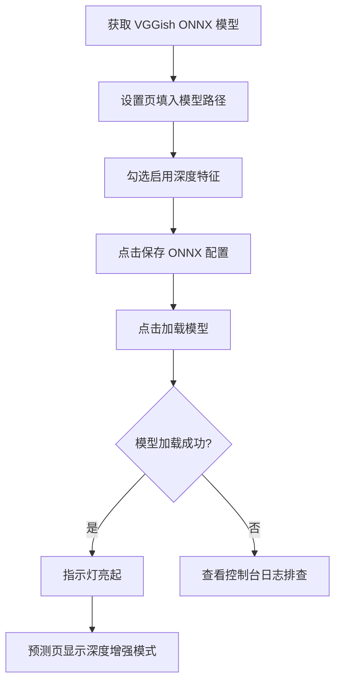

# 05 · 功能使用

> 返回 [Wiki 首页](Home) · 上一章 [04-算法原理](04-算法原理) · 下一章 [06-配置说明](06-配置说明)

应用主窗口左侧为导航栏，包含三个功能页：**音乐库 / 预测 / 设置**。

---

## 5.1 音乐库管理

**入口**：左侧导航 → "音乐库"

### 5.1.1 扫描目录

1. 点击"扫描目录"按钮
2. 在弹出的文件夹选择对话框中选中音乐文件夹
3. 系统递归扫描所有支持的音频文件（默认 `.mp3 / .wav / .flac / .m4a`）
4. 每个文件依次执行：解码 → 提取声学特征 →（可选）提取深度特征 → 存入数据库
5. 进度条实时显示扫描进度，扫描完成后列表展示所有歌曲

> **并发控制**：默认最多 2 个文件并行处理（`ScanOptions.MaxConcurrentProcessing`），通过 `SemaphoreSlim` 限流，避免 CPU 过载。

> **幂等性**：已扫描过的文件不会重复处理（`MusicLibraryService.ProcessSongAsync` 会先按 `FilePath` 查询）。

### 5.1.2 标记喜欢

- 每首歌曲右侧显示爱心图标：`♡`（未喜欢）/ `♥`（已喜欢）
- 点击图标切换喜欢状态
- **标记喜欢**：触发画像增量更新（Welford 算法，O(D) 时间）
- **取消喜欢**：触发画像全量重建（O(N·D) 时间）

### 5.1.3 加载已有歌曲

若数据库中已有歌曲记录，可点击"加载"按钮直接展示，无需重新扫描。

### 5.1.4 歌曲列表字段

| 字段 | 说明 |
|------|------|
| 标题 | 默认取文件名（无扩展名） |
| 文件路径 | 完整绝对路径 |
| 喜欢状态 | 爱心图标，点击切换 |
| 声学特征 | 是否已提取（✓/✗） |
| 深度特征 | 是否已提取（✓/✗） |

---

## 5.2 喜好预测

**入口**：左侧导航 → "预测"

### 5.2.1 前置条件

必须先在音乐库中标记至少一首喜欢的歌曲，以构建用户画像。否则预测按钮会提示"请先在音乐库中标记喜欢的歌曲以构建画像"。

> 建议至少标记 **5–10 首**，画像才有代表性。

### 5.2.2 预测步骤

1. **选择音乐文件**：支持两种方式
   - 点击"选择文件"按钮，在文件对话框中挑选（筛选 `*.mp3 / *.wav / *.flac / *.m4a / *.ogg / *.wma`）
   - 直接将文件**拖拽**到放置区（拖入时边框高亮，松开后自动填充路径）
2. 点击"开始预测"按钮
3. 系统执行：解码 → 提取特征 → 与用户画像计算余弦相似度 → 加权映射为 0–100 分
4. 结果区域显示分数与模式

### 5.2.3 结果展示

| 字段 | 说明 |
|------|------|
| **总分**（0–100） | 加权后的匹配度 |
| **声学得分** | 仅声学特征的相似度映射分 |
| **深度得分** | 仅深度特征的相似度映射分（若启用，否则为空） |
| **当前模式** | `声学模式` 或 `深度增强模式` |

### 5.2.4 分数颜色编码

由 `ScoreToColorConverter` 实现：

| 分数区间 | 颜色 | 含义 |
|----------|------|------|
| ≥ 70 | 绿色 `#10b981` | 高度匹配 |
| 30–70 | 黄色 `#f59e0b` | 中等匹配 |
| < 30 | 红色 `#ef4444` | 低匹配 |

### 5.2.5 预测模式说明

| 模式 | 触发条件 | 评分公式 |
|------|----------|----------|
| `深度增强模式` | ONNX 模型已加载 + 待预测歌曲有深度向量 + 画像有深度均值 | $0.4 \times S_a + 0.6 \times S_d$ |
| `声学模式` | 上述任一不满足，或深度相似度计算失败 | $1.0 \times S_a$ |

---

## 5.3 设置

**入口**：左侧导航 → "设置"

### 5.3.1 可配置项

| 配置 | 操作 | 持久化位置 |
|------|------|-----------|
| 声学特征权重 | 调整数值 → 点击"保存权重" | `usersettings.json` |
| 深度特征权重 | 调整数值 → 点击"保存权重" | `usersettings.json` |
| ONNX 模型路径 | 填写路径 → 点击"保存 ONNX 配置" | `usersettings.json` |
| 启用深度特征 | 勾选开关 → 点击"保存 ONNX 配置" | `usersettings.json` |
| 加载模型 | 点击"加载模型"（立即生效，运行时加载到推理引擎） | 内存 |
| 重建画像 | 点击"重建画像"（基于所有已喜欢歌曲全量重算） | `UserProfile` 表 |

### 5.3.2 保存 vs 加载

| 操作 | 效果 | 生效时机 |
|------|------|----------|
| **保存权重 / 保存 ONNX 配置** | 写入 `usersettings.json` | 下次启动（`reloadOnChange` 也会监听） |
| **加载模型** | 即时把 ONNX 模型载入内存 | 立即生效，无需重启 |
| **重建画像** | 全量重算用户画像均值向量 | 立即生效 |

### 5.3.3 权重建议

- 声学权重 + 深度权重之和应为 **1.0**（默认 0.4 + 0.6 = 1.0）
- 若无深度特征，仅声学模式下的 `AcousticOnlyWeight` 应为 1.0
- 权重可通过 [06-配置说明](06-配置说明) 中的配置文件或环境变量覆盖

### 5.3.4 启用深度特征流程



---

## 5.4 拖拽上传

预测页支持拖拽上传音频文件，基于 Avalonia 12 的拖拽 API。

### 交互效果

1. **拖入区域**：边框变为靛蓝色，厚度变为 2px
2. **拖离区域**：边框恢复默认样式
3. **松开文件**：自动填充文件路径到输入框，边框恢复
4. **非文件类型**：忽略，不响应

### 支持的文件类型

拖拽接受任何文件，但预测时仅支持以下扩展名：`.mp3 / .wav / .flac / .m4a / .ogg / .wma`。

---

## 5.5 数据管理

### 5.5.1 数据库位置

默认位于 GUI 项目的输出目录：

```
src/FindMyFavouriteMusic.GUI/bin/Debug/net10.0/findmyfavouritemusic.db
```

可通过 `Database.ConnectionString` 配置项指定绝对路径。

### 5.5.2 重置数据

| 操作 | 方法 |
|------|------|
| 重置画像 | 设置页 → "重建画像"，或取消所有喜欢 |
| 清空所有数据 | 删除 `findmyfavouritemusic.db` 文件后重启应用 |
| 仅清空歌曲 | 直接删除 `Songs` 表记录（需 SQL 工具） |

### 5.5.3 数据备份

SQLite 是单文件数据库，直接复制 `findmyfavouritemusic.db` 即可完成备份。

---

## 5.6 日志查看

应用配置了 `Microsoft.Extensions.Logging.Console`，日志输出到 stdout（控制台）。

从命令行启动应用即可看到结构化日志：

```bash
dotnet run --project src/FindMyFavouriteMusic.GUI
```

日志内容包括：
- 扫描进度（每个文件的处理状态）
- 解码失败原因
- 模型加载状态
- 画像构建与更新事件

---

> 返回 [Wiki 首页](Home) · 上一章 [04-算法原理](04-算法原理) · 下一章 [06-配置说明](06-配置说明)
