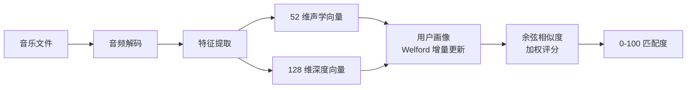

# Find My Favourite Music · Wiki

> 基于 .NET 10 + Avalonia 12 的跨平台音乐品味预测系统

欢迎来到 **Find My Favourite Music** 项目 Wiki！本系统通过分析音频的声学特征与深度学习特征，构建你的音乐品味画像，并预测你会喜欢哪些歌曲。

---

## 项目一览

| 项目 | 说明 |
|------|------|
| **定位** | 跨平台桌面应用，本地分析音乐库，预测个人喜好 |
| **技术栈** | .NET 10 · Avalonia 12 · NAudio · NWaves · ONNX Runtime · SQLite |
| **核心算法** | MFCC 声学特征 + VGGish 深度特征 + Welford 增量画像 + 余弦相似度 |
| **支持格式** | WAV / MP3（跨平台），FLAC / M4A（仅 Windows） |
| **命名空间** | `Larpx.PersonalTools.FindMyFavouriteMusic.*` |

---

## 文档导航

本 Wiki 分为以下章节，建议按顺序阅读；若只想快速上手，可直接跳转 [02-快速开始](02-快速开始)。

| 章节 | 内容 | 适合读者 |
|------|------|----------|
| 📖 [01-项目介绍](01-项目介绍) | 项目背景、核心能力、技术选型 | 所有访客 |
| 🚀 [02-快速开始](02-快速开始) | 环境准备、构建、运行、首次使用 | 新用户 |
| 🏗️ [03-架构设计](03-架构设计) | 分层架构、MVVM、依赖注入、数据流 | 开发者 |
| 🔬 [04-算法原理](04-算法原理) | 解码、特征提取、画像、相似度的数学原理 | 算法学习者 |
| 💡 [05-功能使用](05-功能使用) | 音乐库、预测、设置三大功能详解 | 最终用户 |
| ⚙️ [06-配置说明](06-配置说明) | appsettings.json 全字段说明与优先级 | 运维/进阶用户 |
| 🧩 [07-扩展开发](07-扩展开发) | 新增特征、格式、相似度算法的扩展指南 | 二次开发者 |
| ❓ [08-常见问题](08-常见问题) | FAQ 与故障排查 | 所有用户 |

---

## 核心特性速览

- **双特征体系**：声学特征（MFCC + 频谱质心 + 色度，52 维）+ 深度特征（VGGish，128 维）
- **增量画像**：标记喜欢时 O(D) 时间更新，无需全量重算
- **优雅降级**：无 ONNX 模型时自动切换为仅声学模式
- **跨平台**：Windows / macOS / Linux 桌面端统一代码库

---

## 相关资源

- 📂 **源码仓库**：[Gitee](https://gitee.com/DLarpx/find-my-favourite-music) · [GitHub](https://github.com/Larpx/FindMyFavouriteMusic)
- 📄 **需求与设计文档**：见仓库 `docs/需求与设计文档.md`
- 📄 **算法说明（完整版）**：见仓库 `docs/算法说明.md`
- 📄 **使用说明（完整版）**：见仓库 `docs/使用说明.md`

---

## 版本信息

- **文档版本**：1.0
- **最后更新**：2026-06-30
- **适用代码版本**：基于 `master` 分支截至 2026-06-30 的实现
